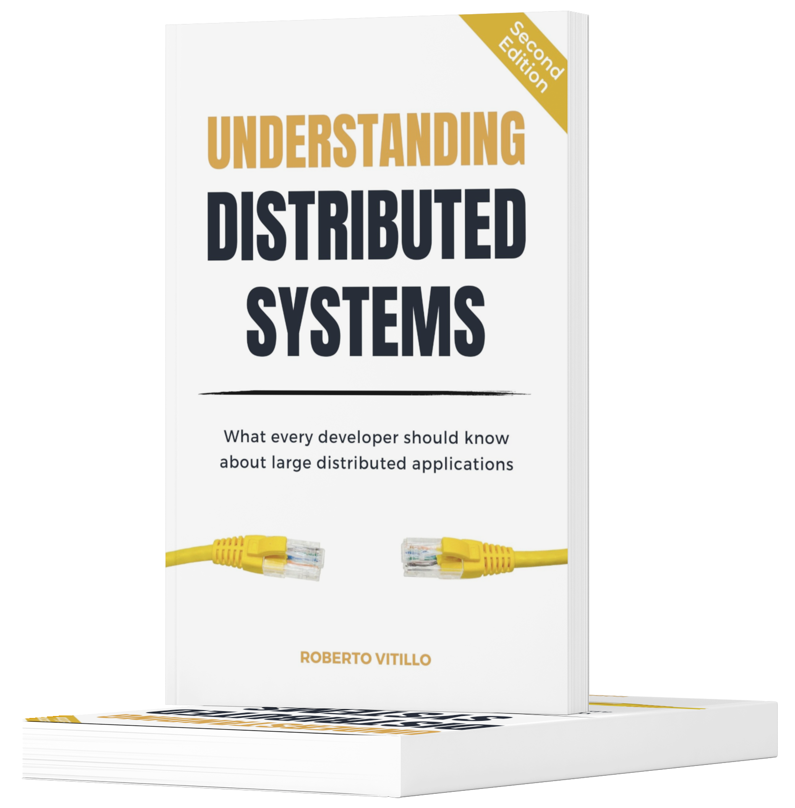

# Understanding Distributed Systems

---
Book notes taken during my read-through of UDS.

- [Part 0 - Introduction](part0/README.md)
- [Part 1 - Communication](part1/README.md)
- [Part 2 - Coordination](part2/README.md)
- [Part 3 - Scalability](part3/README.md)
- [Part 4 - Resiliency](part4/README.md)
- [Part 5 - Maintainability](part5/README.md)