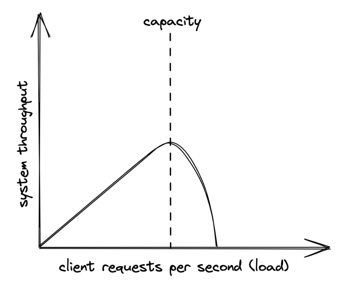

# Introduction

---
- [Preface](#preface)
- [Communication](#communication)
- [Coordination](#coordination)
- [Scalability](#scalability)
- [Resiliency](#resiliency)
- [Maintainability](#maintainability)
- [Anatomy of a distributed system](#anatomy-of-a-distributed-system)

## Preface

---
Most material on distributed systems are either too theoretical or too practical. This book aims at the middle. 
If you're already an expert, this book is not for you. It focuses on breath rather than depth.

Distributed system == group of nodes, communicating over some channel to accomplish a task. Nodes can be a computer, phone, browser, etc.

Why bother building such a system?
* Some apps are inherently distributed - ex the web.
* To achieve high availability - if one node fails, the system doesn't crash.
* To tackle data-intensive workloads which can't fit on a single machine
* Performance requirements - eg Netflix streams HQ tv thanks to serving you a datacenter close to you

The book focuses on tackling the fundamental problems one faces when designing a distributed system.

## Communication

---
First challenge is for nodes to communicate with each other over the network:
* How are requests/response messages represented on the wire?
* What happens when there is a temporary network outage?
* How to avoid man in the middle attacks?

In practice, a nice network library can abstract away those details, but oftentimes abstractions leak, and you need to know how the networks work under the hood.
## Coordination

---
Some form of coordination is required to make two nodes work together.

Good metaphor - <a href="https://en.wikipedia.org/wiki/Two_Generals%27_Problem">The Two Generals Problem</a>

Two generals need to agree on a time to make a joint attack on a city. All messages between them can be intercepted & dropped. How to ensure they attack the city at the same time, despite the faulty communication medium?
## Scalability

---
How efficiently can the application handle load. Ways to measure it depends on the app's use-case - number of users, number of reads/writes, RPS, etc.

For the type of applications covered in the book, load is measured in:
* Throughput - number of requests per second (RPS) the application can process.
* Response time - time elapsed in seconds between sending a request and receiving a response.

When the application reaches a certain threshold in terms of load, throughput starts degrading:

The capacity depends on a system's architecture, implementation, physical limitations (ex CPU, Memory, etc).

An easy way to fix this is to buy more expensive hardware - scaling up. This scaling mechanism has a limit, through, since you can't scale hardware without bounds.

The alternative is to scale horizontally by adding more machines which work together.

## Resiliency

---

## Maintainability

---
## Anatomy of a distributed system