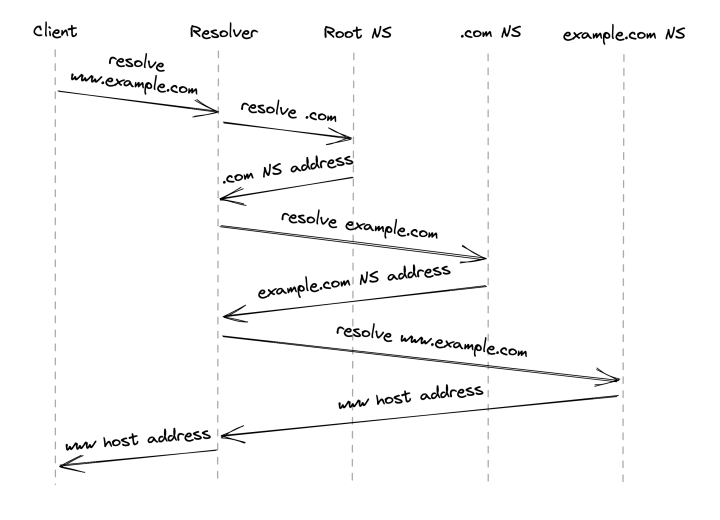
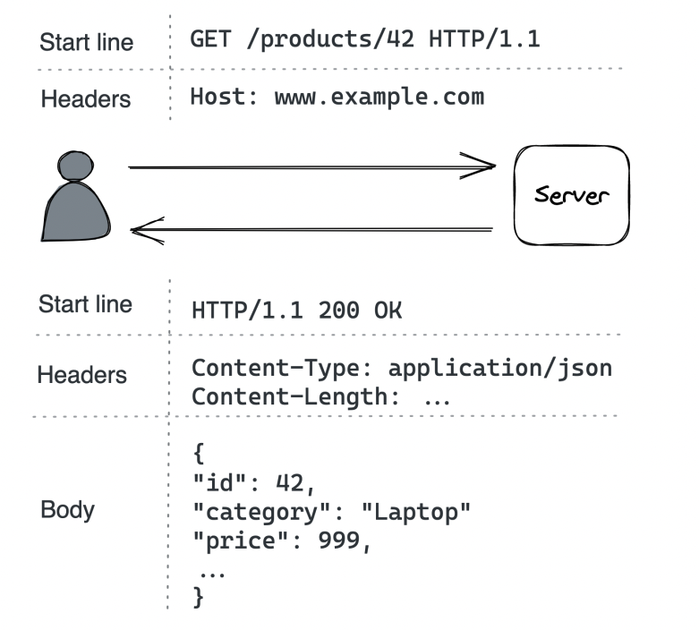

# Communication
* [Introduction](#introduction)
* [Reliable links](#reliable-links)
* [Secure links](#secure-links)
* [Discovery](#discovery)
* [APIs](#apis)

## Introduction
In order for processes to communicate, they need to agree on a set of rules which determine how data is transmitted and processed. Network protocols define these rules.

Network protocols are arranged in a stack - every protocol piggybacks on the abstraction provided by the protocol underneath.


Taking a closer look:
* The link layer provides an interface for operating on the underlying network hardware via ex the Ethernet protocol. Switches operate on this layer and forward Ethernet packets based on their destination MAC address.
* The internet layer provides an interface for sending data from one machine to another with a best-effort guarantee - ie data can be lost, corrupted, etc.
* The transport layer enables transmitting data between processes (different from machines, because you might have N processes on 1 machine). Most important protocol is TCP - it adds reliability to the IP protocol.
* The application layer is a high-level protocol, targeted by applications - ex HTTP, DNS, etc

## Reliable links
Communication between nodes happens by transmitting packages between them. This requires:
1. Addressing nodes
2. A mechanism for routing packets across routers

Addressing is handled by the IP protocol. Routing is handled within the routers' routing tables. Those create a mapping between destination address and the next router along the path. The responsibility of building & communicating the routing tables is handled by the Border Gateway Protocol (BGP).

IP, however, doesn't guarantee the data sent over the internet will arrive at the destination. TCP (Transmission Control Protocol), which lies in the transport layer, handles this. It provides a reliable communication channel on top of an unreliable one (IP). A stream of bytes arrives at the destination without gasp, duplication or corruption. This protocol also has a backoff mechanism in-place to avoid congesting the transportation network, making it a healthy protocol for the internet.

### Reliability
Achieved by:
* Splitting a stream of bytes into discrete segments, which have sequence numbers and a checksum.
* Due to this, the receiver can detect holes, duplicates and corrupt segments (due to checksum).
* Every segment needs to be acknowledged by the receiver, otherwise, they are re-transmitted.

### Connections lifecycle
With TCP, a connection must be established first. The OS manages the connection state on both sides via sockets. 

To establish a connection, TCP uses a three-way-handshake:


1. Sender picks a random sequence number X and sends a SYN segment to receiver
2. Receiver increments X, chooses a random sequence number Y and sends back a SYN/ACK segment
3. Sender increments both sequence numbers and replies with an ACK segment and the first bytes of appdata.

Once a connection is closed, the socket is not released immediately. It has some teardown time as well. Due to this, constantly opening and closing connections can quickly drain your available sockets.

This is typically mitigated by:
* Leveraging connection pools
* Not closing a TCP connection between subsequent request/response pair.

### Flow Control
Flow control is a back-off mechanism which TCP implements to prevent the sender from overflowing the receiver.

Received segments are stored in a buffer, while waiting for the process to read them:


To receive buffer size is also communicated back to the sender when it acknowledges a segment. This way the sender avoids sending more data that can fit the buffer.


### Congestion Control
TCP protects not only the receiver, but the underlying network as well. The sender maintains a so-called `congestion window` which represents the total number of outstanding segments that can be sent without acknowledge from the other side.

The smaller the congestion window, the less bandwidth is utilized. When a connection starts, the congestion window is first to set a system default, and it slowly adjusts based on the feedback from the underlying network:


Timeouts & missed packets adjusts the congestion window down. Successful transmissions adjust it up. Effectively, slower round trip times yield larger bandwidths. Hence, favor placing servers close to clients.

### Custom Protocols
TCP delivers reliability and stability at the expense of extra latency and reduced bandwidth.

UDP (User Datagram Protocol) is an alternative protocol, which doesn't provide TCP's reliability mechanisms. It is used as a canvas for custom protocols to be build on-top which have some of TCP's functionalities but not all.

Games are one example where using TCP is an overhead. If a client misses a single game frame sent from the server, TCP would attempt to retransmit it. However, for games that is unnecessary because the game state would have already progressed once the packet gets retransmitted.

## Secure links
We can now transmit bytes over the network, but they're transmitted in plain-text. We can use TLS (Transport Layer Security) to secure the communication.

TLS provides encryption, authentication and integrity for application-layer protocols (ex HTTP).

### Encryption
Encryption guarantees that transmitted data can only be read by sender and receiver. To everyone else, the data is obfuscated.

When TLS is opened, the client and the server negotiate a shared encryption secret using asymmetric encryption:
1. Each party generates a pair of private and public keys.
2. They exchange the public keys to create a shared secret - the shared secret is not sent.
3. After this, symmetric encryption is used.
* Shared key is periodically renegotiated to minimize the amount of data that can be deciphered.

### Authentication
So far, we've managed to encrypt the data exchange, but we haven't established a way for clients to authenticate who the server is and vice versa.

This is achieved via digital signatures and certificates:
* Digital signature - a server signs some data with their private key. Client can verify if data is indeed created by server by taking the signature and the server's public key.
* Certificate - a document, which include details about the server ( ex name, business, address, etc.).

The client uses the certificate, which the server provides to verify that the server is who they say they are. However, how can the client verify that the public key they received indeed belong to ex: google.com

This is done by having the client cross-check a server's certificate with a certificate authority(CA). Certificates include a server's info, public key, and it is signed by a certificate authority's private key.

If a user has the CA's public key, they use it to check that the certificate is valid. Otherwise, they get the CA's certificate, which is signed by another, higher level, certificate authority. This process repeats until the client finds a certificate signed by a CA they know(they have their public key). By default, browsers have a list of well-knows and trusted certificate authorities.

The chain of certificates always end with a root CA, who self-signs their certificate and is well-known and trusted.


Note: servers don't just send their certificate back to the client. They send the whole certificate chain to avoid additional network calls.

One of the most common mistakes made when using TLS is to let a certificate expire. That prevents clients from connecting to your server via TLS. This is why, automation is important to prevent this from happening.

### Integrity
Encryption prevents middleman from reading transmitted data, while authentication enables us to verify the identity of the server. However, what's stopping a middleman from tampering the transmitted data?

Ex: One could intercept a message, switch a few bytes and the server/client will decode an entirely different message. How can they know if this is the actual message sent by other side or there is someone who's tampered it?

That's where secure hash function and in particular HMACs(Hash-based Message Authentication Code) come into play. Every message is hashed with this function and the hash is included in the message's payload. The client/server can then verify that the message has not been tampered via the formula: `hash(message.payload) == message.hash`. 

In addition to tampering, this process also allows us to detect data corruption. Typically, we can rely on TCP to prevent data corruptions via its checksum, but that mechanism <a href="https://dl.acm.org/doi/10.1145/347057.347561">has a flaw</a> where once every ~16GB-1TB, a data corruption issue is not detected.
### Handshake
When a new TLS connection is opened, a handshake occurs which exchanges the variables used throughout the connection for achieving any of the purposes mentioned so far - encryption, authentication, integrity.

During the handshake, the following events occur:
1. Parties agree on a cipher suite - what encryption algorithms are they going to use. The cipher suite contains:
    * key-exchange algorithms - used to generate shared secrets
    * signature algorithm - used to sign certificates
    * symmetric encryption algorithm - used to encrypt the communication
    * HMAC algorithm - used to verify message integrity
2. The Parties use the key-exchange algorithm to create a shared secret, used afterward for symmetric encryption.
3. The client verifies the certificate provided by the server. Optionally, the server can also verify the client's certificate if one is present(and server is configured to verify it).
    * Client certificates come into play when for ex your server has a fixed, well-known set of clients which are allowed to interact with it.

The operations don't necessarily happen in this order as there are some optimisations which come into play in recent TLS versions.

The bottom line, though, is that instantiating a TLS connection is not free. Hence, put servers close to clients & reuse connections whn possible.

The handshake typically requires 2 round trips with TLS 1.2 and 1 with TLS 1.3.
## Discovery
How do we find out what's the IP address of the server we want to connect to?

DNS(Domain Name System) to the rescue - distributed, hierarchical, eventually consistent key-value store of hostname -> ip address

How does it work?



1. You enter www.example.com into your browser.
2. If the hostname you're looking for is in the browser's cache, it returns it.
3. Otherwise, the lookup request is routed to the DNS resolver - a server, maintained by your internet service provider(ISP).
4. The DNS resolver checks its cache and returns the address if found.
5. If not, lookup request us routed to the root name server (root NS).
6. Root NS maps top-level domain(TLD), eg `.com`, to the NS server responsible for it.
7. DNS resolver send request to TLD NS server `example.com`. NS Server returns the authoritative NS server for `example.com`.
8. DNS resolver sends request to the `example.com`. NS server which returns the IP address for `www.example.com`.

In reality, a lot of caching is involved at each step, enabling us to avoid all the round trips, as domain names rarely change. Caches refresh the domain names based on a time-to-live value (TTL) which every domain name has.

Specifying the TTL is a trade-off:
* if it's too big, and you make a domain name change, some clients will take longer to update.
* if it's to small and average request time will increase

The original DNS protocol sent plain-text messages over UDP for efficiency, but nowadays <a href="https://en.wikipedia.org/wiki/DNS_over_TLS">DNS over TLS (using TCP)</a> is used for security purposes. 

One interesting observation is that a DNS name server can be a single point of failure and lead to outages. A smart migration is to let resolvers serve stale entries vs returning an error in case the name server is down.

The property of a system to continue to function even when a dependency is down is referred to as "static stability".

## APIs

When a client makes a call to a server via their hostname + port, that calls through an adapter which maps the request to interface calls within the server, invoking its business logic.

Communication can be direct or indirect:
* Direct - both processes are up and running and communicate in real-time.
* Indirect - communication is achieved via a broker. One process might be down and receive the message at a later time, asynchronously.

This chapter focuses on direct communication especially on the request-response communication style.

In this style, clients send messages to the server and the server responds back, similar to function calls in a codebase, but across process and network boundaries.

The data format is language agnostic. The format specifies the (de)serialization speed, whether it's human-readable and how hard is to evolve over time.

Popular data formats:
* JSON - textual, human-readable format at the expense of larger data packets and parsing overhead.
* Protocol buffers - binary, efficient format, which has smaller payloads than JSON, but is not human-readable.

When a client sends a request to the server:
* it can block and wait for response (synchronous).
* run the request in a thread and invoke a callback when the response is received(asynchronous).

For most use-cases, we favor asynchronous communication to avoid blocking the UI.

Common IPC technologies for request-response interactions:
* HTTP - slower but more adopted
* gRPC - faster, but not supported by all browser

Typically, server to server communication is implemented via gRPC, client to server is via HTTP.

A popular set of design principles for designing elegant HTTP APIs is REST(Representational State Transfer).

The principles include:
* requests are stateless - each request contains all the necessary information required to process it.
* responses are implicitly or explicitly labeled as cacheable, allowing clients to cache them for subsequent requests.

### HTTP

HTTP is a request-response protocol for client to server communication.



In HTTP 1.1, a message is text-based with 3 parts:
* Start line - In requests, indicates what the request is for, in responses, indicates if the request was successful or not
* Headers - key-value pairs with metadata about the message
* Body - container for data

HTTP is a stateless protocol, hence, all client info needs to be specified within the requests. Servers treat requests as independent, unless there is extra data, indicating what client they're associated with.

HTTP uses TCP for the reliability guarantees and TLS for the security ones. When using TLS, it is referred to as HTTPS.

HTTP 1.1 keeps a connection to a server open between requests to avoid the TCP overhead of re-opening connections. However, it has a limitation that subsequent requests need to wait before the server sends a response back. This is troublesome when for example we load a dozen of images on a page - something which can be done in parallel.

Browsers typically work around this by making multiple connections to the server for fetching independent resources. The price for this workaround is using more memory and sockets.

HTTP 2 was designed to address the limitations of HTTP 1.1 - it uses a binary protocol vs. a textual one. This allows multiplexing multiple concurrent requests-response transactions on the same connection. In early 2020, half of the most visited websites used HTTP 2.

HTTP 3, a package loss only blocks the affected stream, not all of them.

### Resources

Example: a server application we're building - product catalog management for an e-commerce site. Customers can browse the catalog, administrators can create, update or delete products.

We'll build this via an HTTP API. HTTP APIs host resources, which can be physical (ex: image) or abstract (ex: product) entities on which we can execute create/read/update/delete (CRUD) operations.

A URL identifies a resource by describing its location on the server, ex: `https://www.example.com/products?sort=price`:
* `http` is the protocol
* `www.example.com` is the hostname
* `products` is the name of the resource
* `?sort=price` is the query string, which contains additional parameters about how to fetch the results.

A URL can also model relationships between resources, ex:
* `/products/42` - the product with ID 42
* `/products/42/reviews` - the reviews of product with ID 42

We also need to deal with how the resource data is serialized. That is specified by the client via the `Content-type` header, most popular one being `application/json`.

Example JSON-serialized product:
```json
   {
      "name": "John Doe",
      "age": 30,
      "city": "New York"  
   }
```

### Request methods

URLs designate what resource you're targeting. HTTP methods define what operation you're performing on the resource.

Most commonly used operations with example `product` entity:
* `POST /products` - Create new product
* `GET /products` - List all products. Usually includes query parameters to apply filters on the result set.
* `GET /products/42` - Get a particular product
* `PUT /products/42` - Update a product
* `DELETE /products/42` - Delete a product

Request methods are categorized based on whether they are safe and idempotent:
* Safe - don't have visible side effects, hence, can safely be cached
* Idempotent - can be executed multiple times and the end result should be the same as if it was executed once. The property is crucial for APIs (covered later)

| Methods | Safe | Idempotent |
|---------|------|------------|
| POST    | NO   | NO         |
| GET     | Yes  | Yes        |
| PUT     | NO   | Yes        |
| GET     | NO   | Yes        |

### Response status codes

Responses contain a status code, which indicates whether the request is successful or not:

* 200-299 - indicate success, ex 200 OK
* 300-399 - used for redirection, ex 301 Moved Permanently indicates the resource is moved to a different URL. The new URL is specified in the `Location` header.
* 400-499 - client errors
  * 400 Bad Request - when ex input format is wrong
  * 401 Unauthorized - when ex password on login is wrong
  * 403 Forbidden - when ex you don't have access to resource
  * 404 Not Found - when ex the specified resource doesn't exist
* 500-599 - server errors, when ex the database is down & you can't process the request. These requests can typically be retried.
  * 500 Internal Server Error - server encountered unexpected error, due to which request can't be handled
  * 502 Bad Gateway - server, while acting as proxy, received a downstream server error
  * 503 Service Unavailable - server is unavailable due to ex a temporary heavy load on it.

### OpenAPI

The server's API can be defined via an Interface Definition Language (IDL) - a language-agnostic format, which specifies what the API contains.

This can be used for generating the server's adapter and the client's library for interacting with the server.

The OpenAPI specification evolved from the Swagger project, and it's the most popular IDL for RESTful APIs. It can formally describe an API via YAML format including available endpoints, supported request methods, status codes, schema of the entities.

Example of OpenAPI definition:

```yaml
openapi: 3.0.0
info:
   version: "1.0.0"
   title: Catalog Service API

paths:
   /products:
      get:
         summary: List products
         parameters:
            - in: query
              name: sort
              required: false
              schema:
                 type: string
         responses:
            "200":
               description: list of products in catalog
               content:
                  application/json:
                     schema:
                        type: array
                        items:
                           $ref: "#/components/schemas/ProductItem"
            "400":
               description: bad input

components:
   schemas:
      ProductItem:
         type: object
         required:
            - id
            - name
            - category
         properties:
            id:
               type: number
            name:
               type: string
            category:
               type: string
```

This can be used to generate an API's documentation, boilerplate adapters and client SDKs.

### Evolution

An API starts out as a well-designed interface, but it would eventually need to change due to change in requirements.

The last thing we need is to change the API and introduce a breaking change. This means that existing client software will stop working properly with the API after the change. Hence, we'll need to modify every single client of the API. Some of them, we might not have access to.

There are two types of breaking changes:
* at the endpoint level - ex: changing `/products` to `/new-products` or making an optional query parameter required.
* at the schema level - ex: changing the type of the `category` property from `string` to `int`.

To tackle this, REST APIs should be versioned (ex `/v1/products`). As a general rule of the thumb, though, REST APIs should evolve in a backwards compatible manner.

Backwards compatible APIs are usually not elegant, but they're practical.

### Idempotency

If an API request times out without knowing the result, a sensible way to tackle this on the client side is to retry the request(one or more times).

Idempotent HTTP requests are susceptible to this technique as executing multiple identical requests yields the same result as executing it once.

Non-idempotent requests, on the other hand, can't be retried so easily, because they can result in a bad state such as for ex: creating the same product twice. To mitigate this, some effort can be done on the server-side to make POST requests idempotent. 

A technique to achieve this is to associate a request with an idempotency key. A key used to detect if this request has already been executed. This can be achieved by having an `Idempotency-Key` header which is a UUID, generated by the client. When a server received such a key, it first checks if there is such a key in the DB. If not, execute the request. If there is one, return the already executed response. These keys can be cleaned up from the database after a while. In other words, they can have a TTL.

One consideration when executing this is to make the act of
1. storing the idempotency key
2. executing the request as an atomic operation

Otherwise, the server can crash right after storing the idempotency key. Hence, after restart, server thinks that product is already created, but is not. 

This is easy to achieve if we're using an ACID database, which has transaction guarantees. It is a lot more challenging if we need to also change the state of an external system during transaction.

An interesting edge-case:
* Client A attempts to create a resource, request fails but resource is created
* Client B deletes the resource
* Client A attempts to create the resource again

What should the response be? - <a href="https://aws.amazon.com/builders-library/making-retries-safe-with-idempotent-APIs/">less surprising behaviour</a> is to return success.

In summary, idempotent APIs enable more robust clients, since they can always retry failures without worrying about consequences.

[Next Chapter](../part2/README.md)