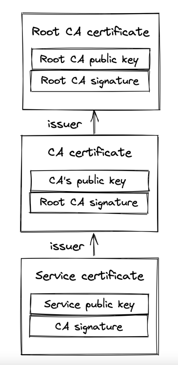

# Communication
* [Introduction](#introduction)
* [Reliable links](#reliable-links)
* [Secure links](#secure-links)
* [Discovery](#discovery)
* [APIs](#apis)

## Introduction
In order for processes to communicate, they need to agree on a set of rules which determine how data is transmitted and processed. Network protocols define these rules.

Network protocols are arranged in a stack - every protocol piggybacks on the abstraction provided by the protocol underneath.

Taking a closer look:
* The link layer provides an interface for operating on the underlying network hardware via ex the Ethernet protocol. Switches operate on this layer and forward Ethernet packets based on their destination MAC address.
* The internet layer provides an interface for sending data from one machine to another with a best-effort guarantee - ie data can be lost, corrupted, etc.
* The transport layer enables transmitting data between processes (different from machines, because you might have N processes on 1 machine). Most important protocol is TCP - it adds reliability to the IP protocol.
* The application layer is a high-level protocol, targeted by applications - ex HTTP, DNS, etc

## Reliable links
Communication between nodes happens by transmitting packages between them. This requires:
1. Addressing nodes
2. A mechanism for routing packets across routers

Addressing is handled by the IP protocol. Routing is handled within the routers' routing tables. Those create a mapping between destination address and the next router along the path. The responsibility of building & communicating the routing tables is handled by the Border Gateway Protocol (BGP).

IP, however, doesn't guarantee the data sent over the internet will arrive at the destination. TCP (Transmission Control Protocol), which lies in the transport layer, handles this. It provides a reliable communication channel on top of an unreliable one (IP). A stream of bytes arrives at the destination without gasp, duplication or corruption. This protocol also has a backoff mechanism in-place to avoid congesting the transportation network, making it a healthy protocol for the internet.

### Reliability
Achieved by:
* Splitting a stream of bytes into discrete segments, which have sequence numbers and a checksum.
* Due to this, the receiver can detect holes, duplicates and corrupt segments (due to checksum).
* Every segment needs to be acknowledged by the receiver, otherwise, they are re-transmitted.

### Connections lifecycle
With TCP, a connection must be established first. The OS manages the connection state on both sides via sockets. 

To establish a connection, TCP uses a three-way-handshake:

1. Sender picks a random sequence number X and sends a SYN segment to receiver
2. Receiver increments X, chooses a random sequence number Y and sends back a SYN/ACK segment
3. Sender increments both sequence numbers and replies with an ACK segment and the first bytes of appdata.

Once a connection is closed, the socket is not released immediately. It has some teardown time as well. Due to this, constantly opening and closing connections can quickly drain your available sockets.

This is typically mitigated by:
* Leveraging connection pools
* Not closing a TCP connection between subsequent request/response pair.

### Flow Control
Flow control is a back-off mechanism which TCP implements to prevent the sender from overflowing the receiver.

Received segments are stored in a buffer, while waiting for the process to read them:

To receive buffer size is also communicated back to the sender when it acknowledges a segment. This way the sender avoids sending more data that can fit the buffer.

### Congestion Control
TCP protects not only the receiver, but the underlying network as well. The sender maintains a so-called `congestion window` which represents the total number of outstanding segments that can be sent without acknowledge from the other side.

The smaller the congestion window, the less bandwidth is utilized. When a connection starts, the congestion window is first to set a system default, and it slowly adjusts based on the feedback from the underlying network:

Timeouts & missed packets adjusts the congestion window down. Successful transmissions adjust it up. Effectively, slower round trip times yield larger bandwidths. Hence, favor placing servers close to clients.

### Custom Protocols
TCP delivers reliability and stability at the expense of extra latency and reduced bandwidth.

UDP (User Datagram Protocol) is an alternative protocol, which doesn't provide TCP's reliability mechanisms. It is used as a canvas for custom protocols to be build on-top which have some of TCP's functionalities but not all.

Games are one example where using TCP is an overhead. If a client misses a single game frame sent from the server, TCP would attempt to retransmit it. However, for games that is unnecessary because the game state would have already progressed once the packet gets retransmitted.

## Secure links
We can now transmit bytes over the network, but they're transmitted in plain-text. We can use TLS (Transport Layer Security) to secure the communication.

TLS provides encryption, authentication and integrity for application-layer protocols (ex HTTP).

### Encryption
Encryption guarantees that transmitted data can only be read by sender and receiver. To everyone else, the data is obfuscated.

When TLS is opened, the client and the server negotiate a shared encryption secret using asymmetric encryption:
1. Each party generates a pair of private and public keys.
2. They exchange the public keys to create a shared secret - the shared secret is not sent.
3. After this, symmetric encryption is used.
* Shared key is periodically renegotiated to minimize the amount of data that can be deciphered.

### Authentication
So far, we've managed to encrypt the data exchange, but we haven't established a way for clients to authenticate who the server is and vice versa.

This is achieved via digital signatures and certificates:
* Digital signature - a server signs some data with their private key. Client can verify if data is indeed created by server by taking the signature and the server's public key.
* Certificate - a document, which include details about the server ( ex name, business, address, etc.).

The client uses the certificate, which the server provides to verify that the server is who they say they are. However, how can the client verify that the public key they received indeed belong to ex: google.com

This is done by having the client cross-check a server's certificate with a certificate authority(CA). Certificates include a server's info, public key, and it is signed by a certificate authority's private key.

If a user has the CA's public key, they use it to check that the certificate is valid. Otherwise, they get the CA's certificate, which is signed by another, higher level, certificate authority. This process repeats until the client finds a certificate signed by a CA they know(they have their public key). By default, browsers have a list of well-knows and trusted certificate authorities.

The chain of certificates always end with a root CA, who self-signs their certificate and is well-known and trusted.

Note: servers don't just send their certificate back to the client. They send the whole certificate chain to avoid additional network calls.

One of the most common mistakes made when using TLS is to let a certificate expire. That prevents clients from connecting to your server via TLS. This is why, automation is important to prevent this from happening.

### Integrity
Encryption prevents middleman from reading transmitted data, while authentication enables us to verify the identity of the server. However, what's stopping a middleman from tampering the transmitted data?

Ex: One could intercept a message, switch a few bytes and the server/client will decode an entirely different message. How can they know if this is the actual message sent by other side or there is someone who's tampered it?

That's where secure hash function and in particular HMACs(Hash-based Message Authentication Code) come into play. Every message is hashed with this function and the hash is included in the message's payload. The client/server can then verify that the message has not been tampered via the formula: `hash(message.payload) == message.hash`. 

In addition to tampering, this process also allows us to detect data corruption. Typically, we can rely on TCP to prevent data corruptions via its checksum, but that mechanism <a href="https://dl.acm.org/doi/10.1145/347057.347561">has a flaw</a> where once every ~16GB-1TB, a data corruption issue is not detected.
### Handshake
When a new TLS connection is opened, a handshake occurs which exchanges the variables used throughout the connection for achieving any of the purposes mentioned so far - encryption, authentication, integrity.

During the handshake, the following events occur:
1. Parties agree on a cipher suite - what encryption algorithms are they going to use. The cipher suite contains:
    * key-exchange algorithms - used to generate shared secrets
    * signature algorithm - used to sign certificates
    * symmetric encryption algorithm - used to encrypt the communication
    * HMAC algorithm - used to verify message integrity
2. The Parties use the key-exchange algorithm to create a shared secret, used afterward for symmetric encryption.
3. The client verifies the certificate provided by the server. Optionally, the server can also verify the client's certificate if one is present(and server is configured to verify it).
    * Client certificates come into play when for ex your server has a fixed, well-known set of clients which are allowed to interact with it.

The operations don't necessarily happen in this order as there are some optimisations which come into play in recent TLS versions.

The bottom line, though, is that instantiating a TLS connection is not free. Hence, put servers close to clients & reuse connections whn possible.

The handshake typically requires 2 round trips with TLS 1.2 and 1 with TLS 1.3.
## Discovery

## APIs

[Next Chapter](../part2/README.md)