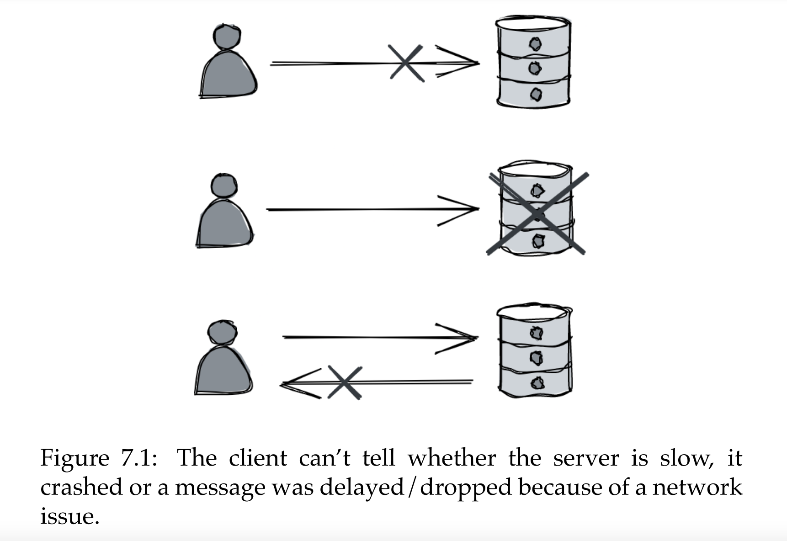
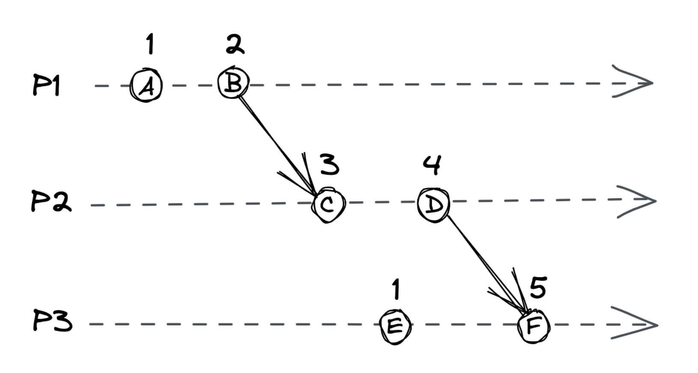
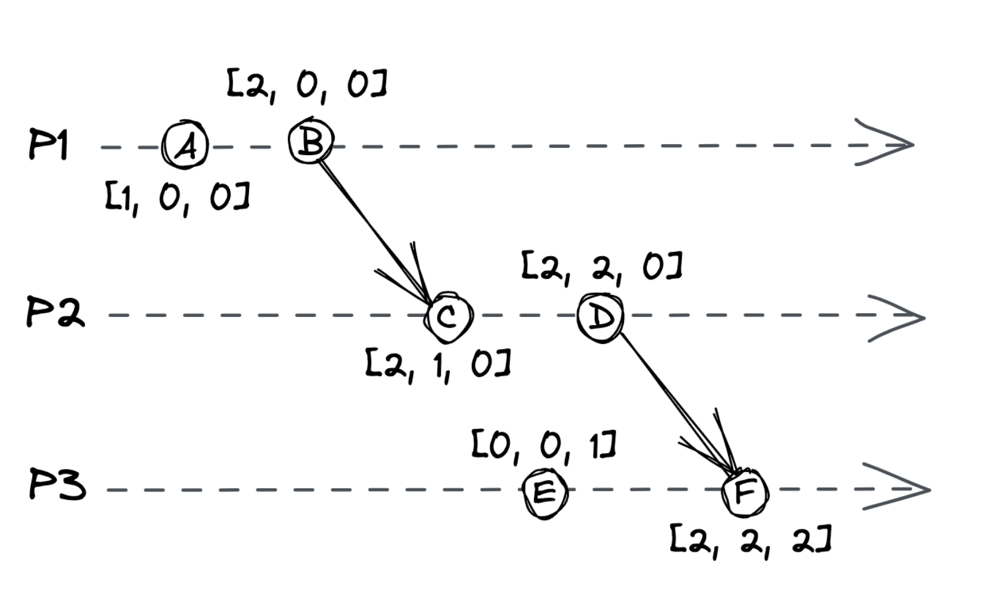
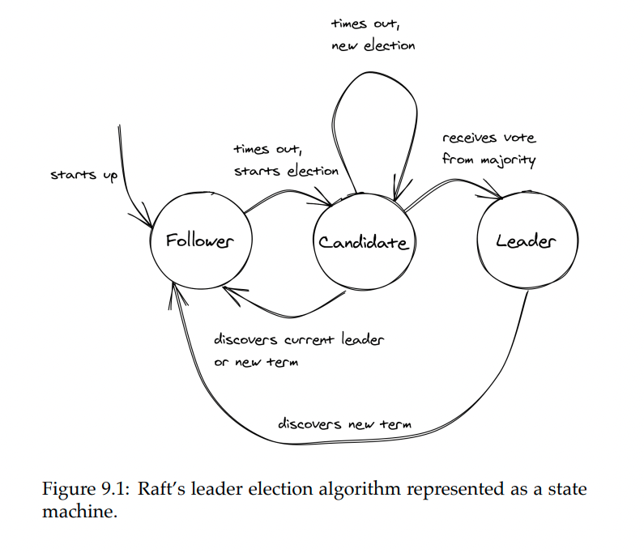
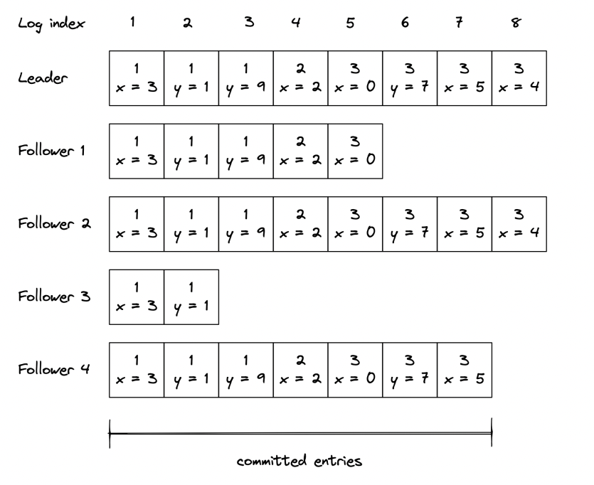

# Coordination
* [System Models](#system-models)
* [Failure Detection](#failure-detection)
* [Time](#time)
* [Leader Election](#leader-election)
* [Replication](#replication)
* [Coordination avoidance](#coordination-avoidance)
* [Transactions](#transactions)
* [Asynchronous transactions](#asynchronous-transactions)
* [Summary](#summary)

So far, focus is on making nodes communicate. Focus now is to make nodes coordinate as if they're a single coherent system.

## System Models
 To reason about distributed systems, we must strictly define what can and cannot happen.
 
A system model is a set of assumptions about the behaviour of processes, communication links and timing while abstracting away the complexities of the technology being used.

Some common models for communication links:
* fair-loss link - messages may be lost and duplicated, but if sender keeps retransmitting messages, they will eventually be delivered.
* reliable link - messages are delivered exactly once without loos or duplication. Reliable links can be implemented on top of fair-loss links by deduplicating messages at receiving end.
* authenticated reliable link - same as reliable link but also assumes the receiver can authenticate the sender

Although these model process behaviour based on the types of failures we can expect:
* arbitrary-fault model - aka "Byzantine" model, the process can deviate from algorithm in unexpected ways, leading to crashes due to bugs or malicious activity.
* crash-recovery model - process doesn't deviate from algorithm, but can crash and restart at any time, losing its in-memory state.
* crash-stop model - process doesn't deviate from algorithm, it can crash and when it does, it doesn't come back online. Used to model unrecoverable hardware faults.

The arbitrary-fault model is used to describe systems which are safety-critical or not in full control of all the processes - airplanes, nuclear power plants, the bitcoin digital currency.

This model is out of scope for this book. Algorithms presented mainly focus on the crash-recovery model.

Finally, we can model timing assumptions:
* synchronous model - sending a message or executing an operation never takes more than a certain amount of time. Not realistic for the kind of systems we're interested in.
  * Sending messages over the network can take an indefinite amount of time. Processes can also be slowed down by garbage collection cycle.
* asynchronous model - sending a message or executing an operation can take an indefinite amount of time.
* partially synchronous model - Typically representative enough of real-world systems.

Through the book, we'll assume a system model with fair-loss links, crash-recovery process and partial syncrony.

## Failure Detection

When a client sends a request to a server & doesn't get a reply back, what's wrong with the server?

One can't tell, it might be:
* server is very slow
* it crashed
* there's a network issue

Worst case, client will wait forever until they get a response back. Possible mitigation is to set up timeout, back-pff and retry.

However, a client doesn't need to wait until they have to send a message to figure out that the server is down. They can maintain a list of available processes which they ping or heartbeat to figure out if they're alive:
* ping - periodic request from client to server to check if the process is available
* heartbeat - periodic request from server to client to indicate that the server is still alive

Ping and heartbeats are used is situations where processes communicate with each other frequently, Ex: within a microservice deployment

## Time
Time is critical in distributed systems:
* On the network layer for DNS TTL records
* For failure detection via timeouts
* For determining ordering of events in a distributed system

The last use-case is the one we're going to tackle in the chapter.

The challenge with that is that in distributed systems, there is no single global clock all services agree on unlike a single-threaded application where events happen sequentially.

We'll be exploring a family of clocks which work out of order of operations in a distributed system.

### Physical Clocks
Processes have access to a physical wall-time clock. Every machine has one. The most common one is based on a vibrating quartz crystal, which is cheap but not insanely accurate.

Because quartz clocks are not accurate, they need to be occasionally synced with servers with high-accuracy clocks. This kind of servers are equipped with atomic clocks, which are based on quantum mechanics. They are accurate up to 1s in 3 million years.
Most common protocol used for time synchronization is the Network Time Protocol(NTP). Clients synchronize their clock via this protocol, which also factors in the network latency. The problem with this approach is that the clock can go back in time on the origin machine. This can lead to a situation where operation A which happens after operation B has a smaller timestamp.

An alternative is to use a clock, provided by most OS is a monotonic clock. It's a forward-only moving clock which measures time elapsed since a given event (counting how much time has passed since the system started, making it ideal for measuring durations). This is useful for measuring time elapsed between timestamps on the same machine, but not for timestamps across multiple ones.

### Logical Clocks
Logical clocks measure passing of time in terms of logical operations, not wall-clock time. 

Example: counter, incremented on each operation. This works fine on single machines, but what if there are multiple machines.

A Lamport clock is an enhanced version where each message sent across machines includes the logical clock's counter. Receiving machines take into consideration the counter of the message they receive. Subsequent operations are timestamped with a counter bigger than the one they received.

With this approach, dependent operations will have different timestamps, but unrelated one can have identical ones. To break ties, the process ID can be included as a second ordering factor.

Regardless of this, logical clocks don't imply a causal relationship. It is possible for event A to happen before B even if B's timestamp is greater.

### Vector Clocks
Vector clocks are logical clocks with the additional property of guaranteeing that event A happened before event B if A's timestamp is smaller than B.

Vector clocks have an array of counters, one for each process in the system:
* Counters start from 0
* When an operation occurs, the process increments its process counter by 1
* Sending a message increments the process counter 1. The array is included in the message
* Receiving process merges the received array with its local one by taking the max for each element
  * Finally, its process counter is incremented by 1

This guarantees that event A happened before B if:
* Every counter in A is `less than` or `equal` to every counter in B
* At least one counter in A is `less than` corresponding counter in B
If neither A happened before B nor B happened before A, the operations are considered concurrent

In the above example:
* B happened before C
* E and C are concurrent

#### Vector Clock Comparison Table: 
| Scenario             | Event A VC     | Event B VC     | Comparison Steps                                                                                   | Result                         |
|----------------------|----------------|----------------|------------------------------------------------------------------------------------------------------|--------------------------------|
| **Happens-Before**   | [2, 1, 0]      | [3, 2, 0]      | A[0] ≤ B[0] ✔️ (2 ≤ 3)    A[1] ≤ B[1] ✔️ (1 ≤ 2)    A[2] ≤ B[2] ✔️ (0 ≤ 0)    At least one strictly less ✔️ | ✅ A → B (A happened before B) |
| **Concurrent Events**| [1, 2, 0]      | [2, 1, 0]      | A[0] ≤ B[0] ✔️ (1 ≤ 2)    A[1] > B[1] ❌ (2 > 1) → Rule broken                                     | ❌ A and B are concurrent      |
| **Equal Vectors**    | [3, 2, 0]      | [3, 2, 0]      | All entries equal ✔️   But none is strictly less ❌                                               | ❌ Same event / indistinguishable |

A downside of vector clocks is that storage requirements grow with every new process. Other types of logical clocks, like [dotted version clocks](https://queue.acm.org/detail.cfm?id=2917756)

### Summary
Using physical clocks for timestamps is good for some records such as logs.

However, when you need to derive the order of events across different processes, you'll need vector clocks.

## Leader Election
There are some use-cases where 1 among N processes needs to gain exclusive rights to accessing a shared resource or to assign work to others. To achieve this, one needs to implement a leader-election algorithm to elect a single process to be a leader among a group of equally valid candidates.

Leader election solves the "who’s in charge?" problem in any system where coordination or exclusivity is required. Without it:
* Systems may duplicate work
* Compete for resources
* Make conflicting decisions 
* Become inconsistent or fail entirely

There are two properties this algorithm needs to sustain:
* Safety - there will always be one leader elected at a time
* Liveness - the process will work correctly even in the presence of failures

This chapter explore a particular leader-election algorithm - Raft, and how it guarantees these properties

### Raft leader election
Every process is a state machine with one of three states:
### Raft Process States
Every process is a state machine with one of three states

| State      | Description |
|------------|-------------|
| **Follower**  | - Default state.   - Passively listens for messages from a leader or candidate.   - Responds to heartbeats and votes.   - Doesn't initiate actions on its own. |
| **Candidate** | - Becomes active when it hasn’t heard from a leader for a timeout period.   - Starts a new election.   - Asks other processes to vote for it. |
| **Leader**    | - The elected process.   - Sends heartbeats to followers.   - Handles client requests.   - Responsible for replicating and committing log entries. |

Time is divided into election terms, numbered with consecutive integers (logical timestamp). A term begins with a new election - one or more candidates attempt to become the leader.

When system start-up, processes begin their journey as followers. As a follower, the process expects a periodic heartbeat from the leader. If one does not arrive, a timeout begins ticking after which the process starts a new election and transitions into the candidate state. In the candidate state, the process sends a request to all other notes, asking them to vote for them as the new leader. In the candidate state, the process sends a request to all other notes, asking them to vote for them as the new leader.

State transition happens when:
* Candidate wins the election - majority of processes vote for process, hence it wins the election.
* Another process wins - when a leader heartbeat is received /w election term index `greater than or equal` to current one.
* No one wins election - due to split vote. Then, after a random timeout (to avoid consecutive split votes), a new election starts.

#### <u>How Raft Leader Election Works</u>
Initial State
* All nodes start as followers
* One node eventually becomes leader
* Leader sends periodic heartbeats (AppendEntries RPCs) to followers to assert authority

What if the Leader fails?

1. Election Timeout
   * If a follower doesn't receive a heartbeat within a randomized election timeout (e.g., 150–300ms), it becomes a candidate.
2. Candidate Start Election
   * The candidate:
     * Increments its `term number`
       * Votes for `itself`
     * Sends RequestVote RPCs to `all other nodes`
3. Other Nodes Receive the vote Request
   * Each node will `vote for at most one candidate per term`, and only if:
     * The candidate's `term number is equal to or greater` than theirs
     * The candidate's log is `at least as up-to-date` as theirs
   * If those are true: They vote for the candidate
   * Otherwise: They ignore or reject the request
4. Winning the Election
   * A candidate becomes `leader` if it receives `a majority of votes`.
   * Example:
     * In a 5-node cluster, 3 votes are needed to win
     * Once elected, the new leader starts sending heartbeats to followers

What if there is a split vote?

This can happen:
* Two (or more) nodes become candidates at the same time
* Each gets votes, but `no one reaches a majority`.
Solution:
* They `wait for a randomized timeout` and retry the election
* Eventually, one will win - because their timeout fires first, or they receive more votes

### Practical considerations
There are also other leader election algorithms but Raft is simple and widely used.

In practice, you would rarely implement leader election from scratch, unless you're aiming to avoid external dependencies. Instead, you can use any faulty-tolerant key-value stores with support for TTL and linearizable CAS(compare-and-swap) operations. This means, in a nutshell, that operations are atomic and there is no possibility for race conditions. 

#### <u>Example: External Systems Using a Fault-Tolerant KVS (like etcd)</u>
What Is a Fault-Tolerant Key-Value Store? At its core is a fault-tolerant key-value store is a distributed database that:
* Stores data as key-value pairs
* Is replicated across multiple nodes
* Can tolerate node failures and still provide consistent data
* Uses consensus algorithms like Raft or Paxos to maintain consistency

Two Different Leadership Models

1. Native Consensus Systems (like Raft or Paxos)
   * These are protocols, not just stores.
   * A leader is elected via consensus.
   * Once elected, the leader:
     * Sends heartbeats to followers (e.g., every 100ms)
     * This prevents them from starting an election
   * If heartbeats stop → followers trigger a new election.

   This is what happens inside etcd, ZooKeeper, Consul internally.

2. External Systems Using a Fault-Tolerant KVS (like etcd)
   * You're building your own leader election on top of etcd.
     * No internal heartbeat system between your nodes.
     * You use etcd’s key `/leader` as a coordination point.
   * In this model:
     * One node writes /leader = my-id with a lease (TTL(time-to-live), TTL is a way to expire keys automatically.)
     * Others don’t receive heartbeats — they don’t know directly if the leader is alive
     * So they watch `/leader` using the KVS watch API
   * This tells them:
     * If the key gets deleted(TTL expires)
     * If the key changes(a new leader)
       
    In this model, the “heartbeat” is just the leader keeping the key alive.
   fault-tolerant key-value store is a distributed database that:

However, there is a possibility for race conditions after you acquire the lease. It is possible that there is some network issue during which you lose the lease, but you still think you're the leader. This has [leaded to big outages in the past](https://ravendb.net/articles/avoid-rolling-your-own-leader-election-algorithm). 

As a rule of the thumb, leaders should do as little work as possible, and we should be prepared to occasionally have more than one leaders.

## Replication
Data replication is fundamental for distributed system. One reason for doing that is to increase availability. If data is stored on a single process, and it goes down, the data is no longer available. Another reason to scale - the more replicas there are, the more clients can be supported concurrently.

The challenge of replication is to keep them consistent with one another in the event of failure. The chapter will explore Raft's replication algorithm which provides the strongest consistency guarantee - to clients, the data appears to be stored on a single process.

Parox is a more popular protocol, but we're exploring Raft as it's simpler to understand. Raft is based on state machine replication - leader emits events for state change and all followers update their state when the event is received. As long as the followers execute the same sequence of operations as the leader, they will end up with the same state. Unfortunately, just broadcasting the event is not sufficient in the event of failures(Ex: network outages).

Example of state-machine replication with a distributed key-value store:
* KV store accepts operations `put(k,v)` and `get(k)`
* State is stored in a dictionary

If every node executes the same sequence of puts, the state is consistent across all of them.

### State machine replication
When the system starts up, leader is elected using Raft's leader election algorithm, which was already discussed. State changes are persisted in an event log which is replicated to followers.

Note: The number in the boxes above the operation is the leader election term.

The replication algorithm works as follows:
* Only the leader can accept state updates
1. Leader receives a client update
   * It appends the entry to its local log, but does not apply it to the state machine yet.
2. Leader sends AppendEntries RPC to all followers
    * This includes the new log entry. 
    * If no new entries, it acts as a heartbeat.
3. Followers receive the entry
    * They append it to their own log, but also do not apply it to state yet. 
    * They send an ack back to the leader.
4. Leader waits for quorum (majority) of acks
    * Once a quorum (>50% acks from nodes) acknowledges, the leader:
      * Marks the entry as committed 
      * Applies it to its state machine
5. Next heartbeat or AppendEntries
    * Informs followers that the entry is now committed. 
    * Followers apply it to their own state machines.

Such a system can tolerate F failures where total nodes = 2F + 1.

<u>What Happens During Failures?</u>

_If the Leader Dies_
* A new election is triggered.
* But to prevent outdated logs from becoming a leader:
  * A candidate can only be voted if it's log is at least as up-to-date as the voter's log.

_If a Follower Crashes and Recovers_
* The leader sends an `AppendEntries` request with:
  * The previous logs index + term
  * The new log entry
* The follower checks:
  * If it has the previous log entry -> append the new one
  * If the previous log doesn't match -> reject the entry
* The leader then backs up one entry at a time, sending:
  * The previous N log entries(Last two messages. If those are also rejected, the last three are sent and so forth)
  * Until the follower has enough to catch up and accept the log

Eventually, the follower becomes consistent and resumes normal operation.

### Consensus
Solving state machine replication lead us to discover a solution to an important distributed system problem - achieving consensus among a group of nodes.

Consensus definition:
*