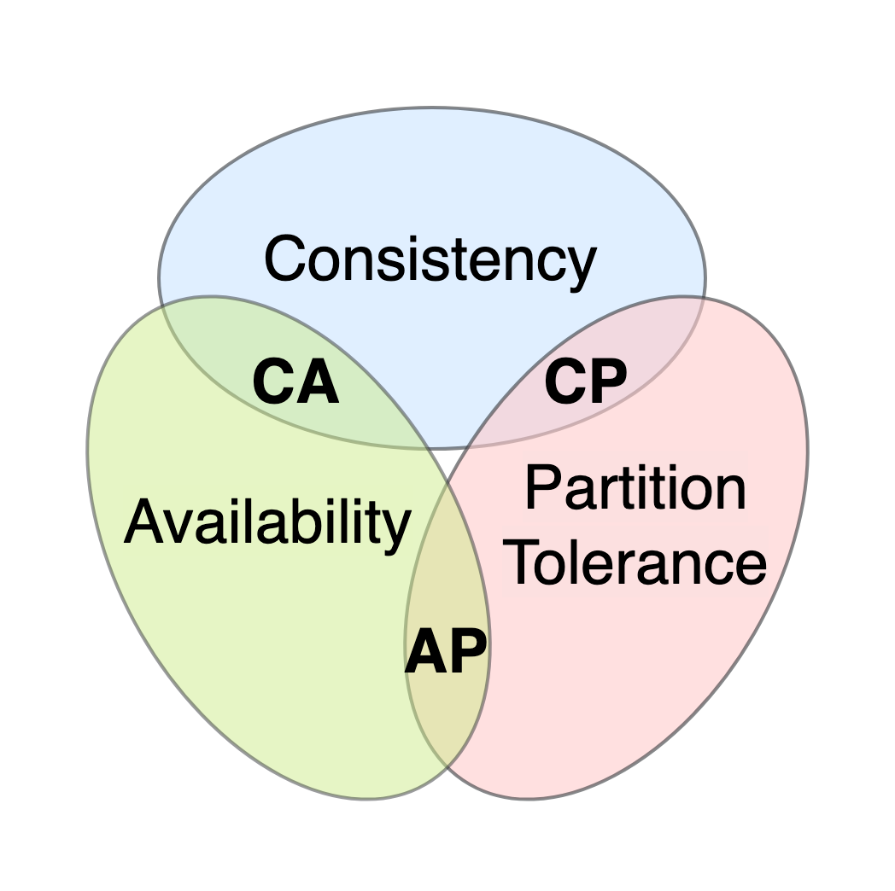

# Coordination
* [System Models](#system-models)
* [Failure Detection](#failure-detection)
* [Time](#time)
* [Leader Election](#leader-election)
* [Replication](#replication)
* [Coordination avoidance](#coordination-avoidance)
* [Transactions](#transactions)
* [Asynchronous transactions](#asynchronous-transactions)
* [Summary](#summary)

So far, focus is on making nodes communicate. Focus now is to make nodes coordinate as if they're a single coherent system.

## System Models
 To reason about distributed systems, we must strictly define what can and cannot happen.
 
A system model is a set of assumptions about the behaviour of processes, communication links and timing while abstracting away the complexities of the technology being used.

Some common models for communication links:
* fair-loss link - messages may be lost and duplicated, but if sender keeps retransmitting messages, they will eventually be delivered.
* reliable link - messages are delivered exactly once without loos or duplication. Reliable links can be implemented on top of fair-loss links by deduplicating messages at receiving end.
* authenticated reliable link - same as reliable link but also assumes the receiver can authenticate the sender

Although these model process behaviour based on the types of failures we can expect:
* arbitrary-fault model - aka "Byzantine" model, the process can deviate from algorithm in unexpected ways, leading to crashes due to bugs or malicious activity.
* crash-recovery model - process doesn't deviate from algorithm, but can crash and restart at any time, losing its in-memory state.
* crash-stop model - process doesn't deviate from algorithm, it can crash and when it does, it doesn't come back online. Used to model unrecoverable hardware faults.

The arbitrary-fault model is used to describe systems which are safety-critical or not in full control of all the processes - airplanes, nuclear power plants, the bitcoin digital currency.

This model is out of scope for this book. Algorithms presented mainly focus on the crash-recovery model.

Finally, we can model timing assumptions:
* synchronous model - sending a message or executing an operation never takes more than a certain amount of time. Not realistic for the kind of systems we're interested in.
  * Sending messages over the network can take an indefinite amount of time. Processes can also be slowed down by garbage collection cycle.
* asynchronous model - sending a message or executing an operation can take an indefinite amount of time.
* partially synchronous model - Typically representative enough of real-world systems.

Through the book, we'll assume a system model with fair-loss links, crash-recovery process and partial syncrony.

## Failure Detection

When a client sends a request to a server & doesn't get a reply back, what's wrong with the server?

One can't tell, it might be:
* server is very slow
* it crashed
* there's a network issue

Worst case, client will wait forever until they get a response back. Possible mitigation is to set up timeout, back-pff and retry.


However, a client doesn't need to wait until they have to send a message to figure out that the server is down. They can maintain a list of available processes which they ping or heartbeat to figure out if they're alive:
* ping - periodic request from client to server to check if the process is available
* heartbeat - periodic request from server to client to indicate that the server is still alive

Ping and heartbeats are used is situations where processes communicate with each other frequently, Ex: within a microservice deployment

## Time
Time is critical in distributed systems:
* On the network layer for DNS TTL records
* For failure detection via timeouts
* For determining ordering of events in a distributed system

The last use-case is the one we're going to tackle in the chapter.

The challenge with that is that in distributed systems, there is no single global clock all services agree on unlike a single-threaded application where events happen sequentially.

We'll be exploring a family of clocks which work out of order of operations in a distributed system.

### Physical Clocks
Processes have access to a physical wall-time clock. Every machine has one. The most common one is based on a vibrating quartz crystal, which is cheap but not insanely accurate.

Because quartz clocks are not accurate, they need to be occasionally synced with servers with high-accuracy clocks. This kind of servers are equipped with atomic clocks, which are based on quantum mechanics. They are accurate up to 1s in 3 million years.
Most common protocol used for time synchronization is the Network Time Protocol(NTP). Clients synchronize their clock via this protocol, which also factors in the network latency. The problem with this approach is that the clock can go back in time on the origin machine. This can lead to a situation where operation A which happens after operation B has a smaller timestamp.

An alternative is to use a clock, provided by most OS is a monotonic clock. It's a forward-only moving clock which measures time elapsed since a given event (counting how much time has passed since the system started, making it ideal for measuring durations). This is useful for measuring time elapsed between timestamps on the same machine, but not for timestamps across multiple ones.

### Logical Clocks
Logical clocks measure passing of time in terms of logical operations, not wall-clock time. 

Example: counter, incremented on each operation. This works fine on single machines, but what if there are multiple machines.

A Lamport clock is an enhanced version where each message sent across machines includes the logical clock's counter. Receiving machines take into consideration the counter of the message they receive. Subsequent operations are timestamped with a counter bigger than the one they received.


With this approach, dependent operations will have different timestamps, but unrelated one can have identical ones. To break ties, the process ID can be included as a second ordering factor.

Regardless of this, logical clocks don't imply a causal relationship. It is possible for event A to happen before B even if B's timestamp is greater.

### Vector Clocks
Vector clocks are logical clocks with the additional property of guaranteeing that event A happened before event B if A's timestamp is smaller than B.

Vector clocks have an array of counters, one for each process in the system:
* Counters start from 0
* When an operation occurs, the process increments its process counter by 1
* Sending a message increments the process counter 1. The array is included in the message
* Receiving process merges the received array with its local one by taking the max for each element
  * Finally, its process counter is incremented by 1

This guarantees that event A happened before B if:
* Every counter in A is `less than` or `equal` to every counter in B
* At least one counter in A is `less than` corresponding counter in B
If neither A happened before B nor B happened before A, the operations are considered concurrent


In the above example:
* B happened before C
* E and C are concurrent

#### Vector Clock Comparison Table: 
| Scenario             | Event A VC     | Event B VC     | Comparison Steps                                                                                   | Result                         |
|----------------------|----------------|----------------|------------------------------------------------------------------------------------------------------|--------------------------------|
| **Happens-Before**   | [2, 1, 0]      | [3, 2, 0]      | A[0] ≤ B[0] ✔️ (2 ≤ 3)  <br> A[1] ≤ B[1] ✔️ (1 ≤ 2)  <br> A[2] ≤ B[2] ✔️ (0 ≤ 0)  <br> At least one strictly less ✔️ | ✅ A → B (A happened before B) |
| **Concurrent Events**| [1, 2, 0]      | [2, 1, 0]      | A[0] ≤ B[0] ✔️ (1 ≤ 2)  <br> A[1] > B[1] ❌ (2 > 1) → Rule broken                                     | ❌ A and B are concurrent      |
| **Equal Vectors**    | [3, 2, 0]      | [3, 2, 0]      | All entries equal ✔️ <br> But none is strictly less ❌                                               | ❌ Same event / indistinguishable |

A downside of vector clocks is that storage requirements grow with every new process. Other types of logical clocks, like [dotted version clocks](https://queue.acm.org/detail.cfm?id=2917756)

### Summary
Using physical clocks for timestamps is good for some records such as logs.

However, when you need to derive the order of events across different processes, you'll need vector clocks.

## Leader Election
There are some use-cases where 1 among N processes needs to gain exclusive rights to accessing a shared resource or to assign work to others. To achieve this, one needs to implement a leader-election algorithm to elect a single process to be a leader among a group of equally valid candidates.

Leader election solves the "who’s in charge?" problem in any system where coordination or exclusivity is required. Without it:
* Systems may duplicate work
* Compete for resources
* Make conflicting decisions 
* Become inconsistent or fail entirely

There are two properties this algorithm needs to sustain:
* Safety - there will always be one leader elected at a time
* Liveness - the process will work correctly even in the presence of failures

This chapter explore a particular leader-election algorithm - Raft, and how it guarantees these properties

### Raft leader election
Every process is a state machine with one of three states:
### Raft Process States
Every process is a state machine with one of three states

| State      | Description |
|------------|-------------|
| **Follower**  | - Default state. <br> - Passively listens for messages from a leader or candidate. <br> - Responds to heartbeats and votes. <br> - Doesn't initiate actions on its own. |
| **Candidate** | - Becomes active when it hasn’t heard from a leader for a timeout period. <br> - Starts a new election. <br> - Asks other processes to vote for it. |
| **Leader**    | - The elected process. <br> - Sends heartbeats to followers. <br> - Handles client requests. <br> - Responsible for replicating and committing log entries. |


Time is divided into election terms, numbered with consecutive integers (logical timestamp). A term begins with a new election - one or more candidates attempt to become the leader.

When system start-up, processes begin their journey as followers. As a follower, the process expects a periodic heartbeat from the leader. If one does not arrive, a timeout begins ticking after which the process starts a new election and transitions into the candidate state. In the candidate state, the process sends a request to all other notes, asking them to vote for them as the new leader. In the candidate state, the process sends a request to all other notes, asking them to vote for them as the new leader.

State transition happens when:
* Candidate wins the election - majority of processes vote for process, hence it wins the election.
* Another process wins - when a leader heartbeat is received /w election term index `greater than or equal` to current one.
* No one wins election - due to split vote. Then, after a random timeout (to avoid consecutive split votes), a new election starts.


#### <u>How Raft Leader Election Works</u>
Initial State
* All nodes start as followers
* One node eventually becomes leader
* Leader sends periodic heartbeats (AppendEntries RPCs) to followers to assert authority

What if the Leader fails?

1. Election Timeout
   * If a follower doesn't receive a heartbeat within a randomized election timeout (e.g., 150–300ms), it becomes a candidate.
2. Candidate Start Election
   * The candidate:
     * Increments its `term number`
       * Votes for `itself`
     * Sends RequestVote RPCs to `all other nodes`
3. Other Nodes Receive the vote Request
   * Each node will `vote for at most one candidate per term`, and only if:
     * The candidate's `term number is equal to or greater` than theirs
     * The candidate's log is `at least as up-to-date` as theirs
   * If those are true: They vote for the candidate
   * Otherwise: They ignore or reject the request
4. Winning the Election
   * A candidate becomes `leader` if it receives `a majority of votes`.
   * Example:
     * In a 5-node cluster, 3 votes are needed to win
     * Once elected, the new leader starts sending heartbeats to followers

What if there is a split vote?

This can happen:
* Two (or more) nodes become candidates at the same time
* Each gets votes, but `no one reaches a majority`.
Solution:
* They `wait for a randomized timeout` and retry the election
* Eventually, one will win - because their timeout fires first, or they receive more votes

### Practical considerations
There are also other leader election algorithms but Raft is simple and widely used.

In practice, you would rarely implement leader election from scratch, unless you're aiming to avoid external dependencies. Instead, you can use any faulty-tolerant key-value stores with support for TTL and linearizable CAS(compare-and-swap) operations. This means, in a nutshell, that operations are atomic and there is no possibility for race conditions. 

#### <u>Example: External Systems Using a Fault-Tolerant KVS (like etcd)</u>
What Is a Fault-Tolerant Key-Value Store? At its core is a fault-tolerant key-value store is a distributed database that:
* Stores data as key-value pairs
* Is replicated across multiple nodes
* Can tolerate node failures and still provide consistent data
* Uses consensus algorithms like Raft or Paxos to maintain consistency


Two Different Leadership Models

1. Native Consensus Systems (like Raft or Paxos)
   * These are protocols, not just stores.
   * A leader is elected via consensus.
   * Once elected, the leader:
     * Sends heartbeats to followers (e.g., every 100ms)
     * This prevents them from starting an election
   * If heartbeats stop → followers trigger a new election.

   This is what happens inside etcd, ZooKeeper, Consul internally.

2. External Systems Using a Fault-Tolerant KVS (like etcd)
   * You're building your own leader election on top of etcd.
     * No internal heartbeat system between your nodes.
     * You use etcd’s key `/leader` as a coordination point.
   * In this model:
     * One node writes /leader = my-id with a lease (TTL(time-to-live), TTL is a way to expire keys automatically.)
     * Others don’t receive heartbeats — they don’t know directly if the leader is alive
     * So they watch `/leader` using the KVS watch API
   * This tells them:
     * If the key gets deleted(TTL expires)
     * If the key changes(a new leader)
       
    In this model, the “heartbeat” is just the leader keeping the key alive.
   fault-tolerant key-value store is a distributed database that:

However, there is a possibility for race conditions after you acquire the lease. It is possible that there is some network issue during which you lose the lease, but you still think you're the leader. This has [leaded to big outages in the past](https://ravendb.net/articles/avoid-rolling-your-own-leader-election-algorithm). 

As a rule of the thumb, leaders should do as little work as possible, and we should be prepared to occasionally have more than one leaders.

## Replication
Data replication is fundamental for distributed system. One reason for doing that is to increase availability. If data is stored on a single process, and it goes down, the data is no longer available. Another reason to scale - the more replicas there are, the more clients can be supported concurrently.

The challenge of replication is to keep them consistent with one another in the event of failure. The chapter will explore Raft's replication algorithm which provides the strongest consistency guarantee - to clients, the data appears to be stored on a single process.

Parox is a more popular protocol, but we're exploring Raft as it's simpler to understand. Raft is based on state machine replication - leader emits events for state change and all followers update their state when the event is received. As long as the followers execute the same sequence of operations as the leader, they will end up with the same state. Unfortunately, just broadcasting the event is not sufficient in the event of failures(Ex: network outages).
Example of state-machine replication with a distributed key-value store:
* KV store accepts operations `put(k,v)` and `get(k)`
* State is stored in a dictionary

If every node executes the same sequence of puts, the state is consistent across all of them.

### State machine replication
When the system starts up, leader is elected using Raft's leader election algorithm, which was already discussed. State changes are persisted in an event log which is replicated to followers.


Note: The number in the boxes above the operation is the leader election term.

The replication algorithm works as follows:
* Only the leader can accept state updates
1. Leader receives a client update
   * It appends the entry to its local log, but does not apply it to the state machine yet.
2. Leader sends AppendEntries RPC to all followers
    * This includes the new log entry. 
    * If no new entries, it acts as a heartbeat.
3. Followers receive the entry
    * They append it to their own log, but also do not apply it to state yet. 
    * They send an ack back to the leader.
4. Leader waits for quorum (majority) of acks
    * Once a quorum (>50% acks from nodes) acknowledges, the leader:
      * Marks the entry as committed 
      * Applies it to its state machine
5. Next heartbeat or AppendEntries
    * Informs followers that the entry is now committed. 
    * Followers apply it to their own state machines.

Such a system can tolerate F failures where total nodes = 2F + 1.

<u>What Happens During Failures?</u>

_If the Leader Dies_
* A new election is triggered.
* But to prevent outdated logs from becoming a leader:
  * A candidate can only be voted if it's log is at least as up-to-date as the voter's log.


_If a Follower Crashes and Recovers_
* The leader sends an `AppendEntries` request with:
  * The previous logs index + term
  * The new log entry
* The follower checks:
  * If it has the previous log entry -> append the new one
  * If the previous log doesn't match -> reject the entry
* The leader then backs up one entry at a time, sending:
  * The previous N log entries(Last two messages. If those are also rejected, the last three are sent and so forth)
  * Until the follower has enough to catch up and accept the log

Eventually, the follower becomes consistent and resumes normal operation.

### Consensus
Consensus is a fundamental problem in distributed systems: How do a group of nodes agree on a single value - even if some nodes fail?

When does Consensus mean exactly? Consensus is achieved when:
* Agreement: All non-faulty nodes eventually decide on the same value.
* Validity: The value must have been proposed by one of the nodes.
* Termination: Every non-faulty node eventually decide on a value.

This ensures that even if some nodes fail or message are delayed, the system reaches a reliable decision.

Real-World use case: Lease Ownership
* You often want only one process to act as a leader or perform a task at any time
* Consensus helps processes agree on who gets the "lease"(exclusive right to act)
* Example: Picking a leader in a distributed cluster.

<u>How it's done in practice</u>

In reality, you don't write your own consensus algorithm. You use battle-tested tools like:
* etcd (used in Kubernetes)
* ZooKeeper (used in older systems like Hadoop, Kafka)

These systems:
* Use consensus internally (like Raft or ZAB)
* Provide a key-value API to store and replicate state
* Are fault-tolerant by replicating state across multiple nodes

Implementing a Lease (With TTL)
* A client tries to create a key with a TTL(ex `/leader`) - a temporary claim
* If it succeeds, it becomes the leader
* Other clients watch the key - if it expired (leader crashed), they try to acquire it again.

### Consistency models
Let's take a closer look at what happens when a client sends a request to a replicated data store.

Ideally the writes are instant:


In reality, writes take some time:


In a replicated data store, writes need to go through the leader, but what about reads?
* If reads are only served by the leader, then clients will always get the latest state, but throughput is limited
* If reads are served by leaders and followers, throughput is higher, but two clients can get different views of the system, in case a follower is lagging behind the leader.

Consistency model help define the trade-off between consistency and performance.

#### Consistency Models Overview
| Model                 | Guarantees                                           | Read Speed      | Trade-off                         | Use Case Example                  |
|----------------------|------------------------------------------------------|-----------------|-----------------------------------|-----------------------------------|
| **Strong Consistency**    | All clients see the latest committed write         | Slower          | Lower availability, higher latency | Banking, config management        |
| **Sequential Consistency**| Operations appear in the same order to all clients | Medium         | Clients may see stale data        | Queues, ordered event processing  |
| **Eventual Consistency**  | All replicas converge eventually                  | Fastest       | No guarantee of latest data       | Analytics, counters, social feeds |

#### Strong Consistency
* All reads and writes go through the **leader**
* Guarantees that observers **see the latest write** once it's persisted.
* The leader must **confirm it's still leader** before confirming a write — this adds **latency** to both reads and writes.
* **Use case**: Bank transactions, user authentication, configuration storage.


#### Sequential Consistency
Serializing all reads through the leader guarantees strong consistency but limits throughput.

An alternative is to enable followers to serve reads and attach clients to particular followers. This will lead to an issue where different clients can see a different state, but operations will always occur in the same order.

Reads can be served by **followers**, but each client is attached to a specific one.
* All operations occur in the **same global order** for all clients.
* Clients may **see different states at the same time**, depending on their follower.
* **Use case**: Message queues, producer/consumer pipelines. Producers and consumers always see the events in the same order, but at different times.


#### Eventual Consistency
In the sequential consistency model, we had to attach clients to particular clients to guarantee in-order state changes. This will be an issue, however, when the follower a client is pinned to is down. The client will have to wait until the follower is back up. An alternative is to allow clients to use any follower. This comes at a consistency price. If follower B is lagging behind follower A and a client first queries follower A and then follower B, they will receive an earlier version of the state.

* Clients can read from **any follower**.
* Follower state may **lag**, so clients might see **older data**.
* Over time, all replicas **converge to the same state**.
* **Use case**: View counters (YouTube, product pages), analytics — where exact precision isn’t critical.

Using an eventually consistent system can lead to subtle bugs, which are hard to debug.

### The CAP Theorem



When a network partition occurs - ie parts of the system become disconnected, the system has two choices:
* Remain highly available by allowing clients to query followers and sacrifice strong consistency
* Guarantee strong consistency by declining reads that can reach the leader.

This dilemma is summarized by the CAP theorem - "strong consistency, availability and fault-tolerance. You can only pick two." In the reality, the choice is only among strong consistency and availability as network faults will always happen. Additionally, consistency and availability are not binary choices. They're a spectrum.

Also, even through network partitions can happen, they're usually rare. But even without them, there is a trade-off between consistency and latency - The stronger the consistency is, the higher the latency is.

Because P (Partition Tolerance) is essential, you’re left to choose between:
* C (Consistency) – All nodes agree on the same state 
* A (Availability) – Every request gets a response (even if stale)

So during a network partition, you have to choose:

| If you pick...                 | You get...                                           |
|----------------------|------------------------------------------------------|
| **CP (Consistency + Partition Tolerance)**    |System might refuse requests, but all data is correct         |
| **AP (Availability + Partition Tolerance)**| System always responds, but might return stale data |

Real-World Examples

| Model | Systems       | Behavior during partition                          |
|--------|---------------|-----------------------------------------------------|
| **CP** | Etcd, ZooKeeper | Prioritize consistency. Might reject writes.        |
| **AP** | Cassandra, DynamoDB | Prioritize availability. Might allow conflicts.     |

The relationship is expressed by the PACELC theorem:
* In case of partition (P), one has to choose between availability (A) and consistency (C)
* Else (E), one has to choose between latency (L) and consistency (C)

Similar to CAP, the choices are a spectrum, not binary. Due to these considerations, there are data stores which come with counter-intuitive consistency guarantees in order to provide strong availability and performance. Others allow you to configure how consistent you want them to be - ex: Amazon's Cosmos DB and Cassandra.

Taken from another angle, PACELC implies that there is a trade-off between the required coordination and performance. One way to design around this is to move coordination away from the critical path.

### Chain Replication
Chain Replication is a different kettle of fish, compared to leader-based replication protocols such as Raft.
* With this scheme, processes are arranged in a chain. Leftmost process is the head, rightmost one is the tail.
* Clients send writes to the head, it makes the state change and forwards to the next node
* Next node persist and forwards it to the one. This continues until the tail is reached.
* After the state update reaches the tail, it acknowledges the receipt back to the previous node. It then acknowledges receipt to previous one and so forth.
* Finally, the head receives the confirmation and informs the client that the write is successful.

Writes go exclusively through the head. Reads, on the other hand, are served exclusively by the tail.


In the absence of failures, this is a strong-consistent model. What happens in the event of a failure? 


Fault tolerance is handled by a separate component, often referred to as the control plane.
This component is replicated to ensure high availability and strong consistency, typically using a consensus algorithm like Raft.

The control plane monitors the health of the system and reacts to node failures:
* If the head fails:
  * A new head is selected from the remaining nodes.
  * Clients are notified to send future writes to the new head.
* If the head persisted a write but failed before propagating it:
  * No harm is done — since the client never received an acknowledgment, the write will be retried, maintaining correctness.
* If the tail fails:
  * Its predecessor becomes the new tail. 
  * Since all updates are forwarded and acknowledged along the chain, the predecessor has the latest committed state.
* If an intermediate node fails:
  * The control plane reconnects its predecessor to its successor. 
  * To ensure consistency, the successor communicates its last acknowledged write to the control plane, which is then used to sync the predecessor.

Fault Tolerance Limits:
* Chain replication can tolerate up to N - 1 failures as long as a contiguous subchain remains. 
* The control plane, typically using a consensus protocol, can tolerate up to ⌊C / 2⌋ node failures, where C is the number of control plane replicas.

Chain Replication: Trade-offs & Optimizations

Chain replication is particularly well-suited for strong consistency, potentially even more than Raft, due to its separation of responsibilities:
* Writes go through the head and flow down the chain.
* Reads are served by the tail, which always has the most up-to-date state.
* The tail doesn't need to coordinate with others to serve a strongly consistent read.

Trade-offs Compared to Raft

| Aspect            | Chain Replication                                             | Raft                                                   |
|-------------------|---------------------------------------------------------------|---------------------------------------------------------|
| Write Latency     | Slower — must go through all nodes                            | Faster — needs only quorum acknowledgment              |
| Failure Recovery  | Slower — depends on control plane detection & reconfiguration | Faster — failure recovery is built into the protocol   |
| Scalability       | Bottlenecked by slowest node in the chain                     | More forgiving — majority-based decision-making        |

Optimizations in Chain Replication

1. Write Pipelining

   Multiple dependent write requests can be in-flight simultaneously(even if they are dependent on one another), improving throughput.
2. Scalable Read Throughput
   
   Even though reads go to the tail for strong consistency, other replicas can also serve reads under certain safeguards:
   * A replica marks data as dirty if a write has passed through it but hasn’t been acknowledged by the tail.
   * If a client reads a dirty object from a replica, that replica first verifies with the tail whether the write is committed.


Chain replication delegates coordination and failure recovery concerns to the control pane. But can we go further? Can we achieve replication without the need for consensus?

## Coordination avoidance
There are two main ingredients to state-machine repository:
* A broadcast protocol which guarantees every replica eventually receives all updates in the same order
* A deterministic update function for each replica

Implementing fault-tolerant total order requires consensus. It is also a scalability bottleneck as it requires one process to handle updates at a time. We'll explore a form of replication which doesn't require total order but still has useful guarantees.

### Broadcast protocols
Network communication over wide area networks like the internet offer unicast protocols only (ex: TCP). To broadcast a message to a group of receivers, a multicast protocol is needed. Hence, we need to implement a multicast protocol over an unicast one. The challenge is supporting multiple senders and receivers that can crash at any point.

**Best-effort broadcast** guarantees that a message will be delivered to all non-faulty in a group. One way to implement it is by sending a message to all senders one by one over reliable links. If, however, the sender fails midway, the receiver will never get the message.


**Reliable broadcast** guarantees that the message is eventually delivered to all non-faulty processes even if the sender crashes before the message is fully delivered. One way to implement it is to make every sender that receives a message retransmit it to the rest of the group. This is known as eager reliable broadcast and is costly as it takes sending the message N^2 times.


**Gossip broadcast** optimizes this by sending the message to a subset of nodes. This approach is probabilistic. It doesn't guarantee that all nodes get the message, but you can minimize the probability of non-reception by turning the config params. This approach is particularly useful when there are large number of nodes as deterministic protocols can't scale to such amounts.


Reliable broadcast protocols guarantees messages are delivered to non-faulty processes, but they don't make ordering guarantees. **Total order broadcast** guarantees both reception & order of messages, but it requires consensus, which is a scalability bottleneck.

Recap of Broadcast Types

| Type                  | Guarantees                                                                 | Cost / Notes                                      |
|-----------------------|-----------------------------------------------------------------------------|---------------------------------------------------|
| **Best-effort**       | Message is delivered to some or all, but no guarantees if sender crashes   | Simple; can fail silently                         |
| **Reliable**          | All non-faulty nodes eventually receive the message                         | Costly (O(N²) messages); better fault tolerance   |
| **Gossip**            | Probabilistically delivered to most nodes                                   | Tunable; scalable for large clusters              |
| **Total Order**       | All nodes receive the **same messages in the same order**                   | Requires consensus; not easily scalable           |

### Conflict-free replicated data types
If we implement replication without guaranteeing total order, we don't need to serialize all writes through a single node. However, since replicas can receive messages in different order, their states can diverge. Hence, for this work, divergence can only be temporary and the replica states need to converge back to the same state.

This is the main mechanism behind eventual consistency:
* Eventual delivery guarantee - every update applied to a replica is eventually applied to all replicas
* Convergence guarantee - replicas that have applied the same updates eventually reach the same state

Using a broadcast protocol that doesn't guarantee message order, can lead to divergence. You'll have to reconcile conflicting writes via consensus that all replicas need to agree to.


This approach has better availability and performance than total order broadcast. Consensus is only required to reconcile conflicts and can be moved off the critical path.

However, there is a way to resolve conflicts without consensus at all - ex: the write with the latest timestamp wins. If we do this, conflicts will be resolved by design and there is no need for consensus. This replication strategy offers stronger guarantees than eventual consistency:
* Eventual delivery - same as before
* Strong convergence - replicas that have executes the same updates **have** the same state

This replication strategy is referred to as **strong eventual consistency**.

#### How it works in practice? Let's consider a system where:
* Each **replica replies immediately** to read queries using its local state.
* When a **write/update** happens:
    * It's applied locally first.
    * Then it's **broadcast to all other replicas**.
* When **a replica receives an update**, it **merges** that update with its current state.

#### But how do we merge conflicts?
There are 2 approaches:
1. With an Arbitrer(Consensus)
   * A central decision-maker resolves conflicting updates
   * Example: "Which write wins?" -> decided by Raft or Paxos
2. Without an Arbitrer (Mathematical Guarantees)
   * To avoid consensus, the system must be designed with data structures that resolve conflicts automatically.
   * 2 conditions must hold:
     * [Semilattice](https://www.youtube.com/watch?v=LCFf2DBTVmo) structure: The object's posible states can be partially ordered (think: increasing versions or sets growing over time).
     * Merge operations: Must be:
       * Idempotent(merging the same update repeatedly has no effect)
       * Commutative(order doesn't matter)
       * Associative(grouping doesn't matter)
   * These ensure **safe, automatic merging** - no coordination needed.
   * This model is often used in **CRDTs(Conflict-Free Replicated Data Types)** such as counters, sets, maps.

**Note**: The next couple of lines are a personal explanation which might not be 100% correct according to mathy folks, but suffice for my own understanding. What this means is that if you visualize a graph of an object's ordered states, if you take two of them (c and d), you might not immediately determine which one is greater, but there is eventually some state which is "greater" than both of the non-comparable states.


Put in to practice, if you have two replicas, whose states have diverged (c and d), eventually, they will converge back to the same value (e). The second part of the requirement mandates that the operation for merging two states needs to be:
* Idempotent : merge(x, x) = x → Merging the same value again doesn't change the result.
* Commutative: merge(x, y) = merge(y, x) → Merge order doesn’t matter.
* Associative: merge(x, merge(y, z)) = merge(merge(x, y), z) → Merge grouping doesn’t matter.

These properties are crucial because:
* Messages can arrive in different orders
* They may arrive more than once
* You can't assume a clean, linear timeline

#### CRDTs: Conflict-Free Replicated Data Types
A data type that satisfies these rules is a part of a family called **CRDTs**. There are two types:
* Convergent (state-based) CRDTs - replicas merge whole states.
* Commutative (operation-based) CRDTs - replicas apply operations in any order.

#### Examples: Integers with a Max Merge
Take integers as an example:
* You define the merge as: `max(x,y)`
* That merge id: idempotent, commutative and associative

So even if different replicas:
* Get updates in random orders,
* Miss some message initially,
* Get duplicates updates

... they'll always converge to the same global maximum, as long as all updates are eventually seen. This kind of system works well even over **unreliable broadcast**(like gossip protocols). Replicas just need to **periodically send their current state** to each other. When received, the states are **merged**.

This background sync process is called **anti-entropy**

#### Real Examples of CRDTs

| CRDT Type  | Description                                                                 | Merge Operation                      |
|------------|-----------------------------------------------------------------------------|--------------------------------------|
| Register   | A memory cell holding a byte array                                          | Merge using partial order & LUB      |
| Counter    | Integer-based counter (e.g. G-Counter or PN-Counter)                       | Merge using max (or +)               |
| Set        | Collection that supports add/remove (e.g. G-Set, 2P-Set, OR-Set)           | Merge using union/diff/tag tracking  |
| Dictionary | Key-value store where values are CRDTs                                     | Merge recursively by key             |
| Graph      | Set of nodes and edges                                                     | Merge by combining nodes and edges   |

> These CRDT types converge even with out-of-order or duplicate messages, often using **anti-entropy** to reconcile differences.

Two common implementations are last-write-wins registers(LWW) and multi-value registers(MV)

#### LWW
LWW registers associate a timestamp with every update, making them order-able. The timestamp can be a Lamport timestamp to preserve happened-before relationship with a replica identifier to break ties. A Lamport clock is sufficient because it guarantees happens-before relationship between dependent events and the updates we have are dependent.


The issue with LWW register is that when there are concurrent updates, one of them randomly wins.

#### MV
An alternative is to store both states in the register and let applications determine which update to take. That's what a MV register does. It uses a vector clock and the merge operation returns the union of all concurrent updates.


CRDTs can be composed - ex: you can have a dictionary of LWW or MV registers. Dynamo-style data stores leverage this.

### Dynamo-style data stores
Dynamo is the most popular eventually consistent and highly available key-value store. Others are inspired by it - Cassandra and Riak KV.

How it works:
* Every replica accepts read and write request
* When a client wants to write, it sends the write request to all N replicas, but waits for acknowledgement from only W replicas(write quorum)
* Reads work similarly to writes - sent to all replicas (N), sufficient to get acknowledgement by a subset of them (R quorum)

To resolve conflicts, entries behave like LWW or MV registers, depending on the implementation you choose.

W and R are configurable based on your needs:
* Stronger consistency - When `W + R > N`, at least one read will always return the latest version.
* This is not guaranteed on its own. Writes sent to N replicas might not make it to all of them. To make this work, writes need to be bundled in an atomic transaction.
* Max performance with consistency cost - `W + R < N`

You can fine-tune read/write performance while preserving strong consistency:
* When R is small, reads are fast at the expense of slower writes and vice versa, assuming you preserve `W + R > N`


This mechanism doesn't guarantee that all replicas will converge on its own. If a replica never receives a write request, it will never converge.

To solve this issue, there are two possible anti-entropy mechanisms you can use:
* Read repair - if a client detects that a replica doesn't have the latest version of a key, it sends a write request to that replica.
* Replica synchronization - Replicas periodically exchange state information to notify each other of their latest's states. To minimize the amount of data transmitted, replicas exchange merkle tree hashes instead of the key-value pairs directly.


### The CALM Theorem
When does an application need coordination (consensus) and when can it use an eventually consistent data store? The **CALM Theorem**(Consistency As Logical Monotonicity) states that a program can be consistent and not use coordination if it is monotonic.

#### What is Monotonicity?
A program is monotonic if: Once it produces an output, new inputs cannot invalidate that output (only add to or refine it).
Think: "forward-only" logic. No rollback.

Examples:
* Monotonic - A counter:
``` 
inc(1), inc(2) = 3
inc(2), inc(1) = 3
```
The order of operations doesn't matter. You allways get the same final result. You can safely run this without consensus - replicas will converge.
* Non-Monotonic - Variable Assigment:
```
set(5), set(3) = 3
set(3), set(5) = 5
```
Order changes the outcome. You need coordination to decline the final state (ex via timestamps or consensus)

#### Can Non-Monotonic be made Monotonic?
Yes! For example:
* Registers(like `set(x)`) can be made monotonic by converting them to:
  * LWW - attach timestamps.
  * MV - keep all conflicting values.

#### But what "consistent" mean?

| Term              | Meaning                                                                 |
|-------------------|-------------------------------------------------------------------------|
| **CAP Consistency**  | Consistency of storage (e.g., reads always reflect latest writes).     |
| **CALM Consistency** | Consistency of application output, even if storage is temporarily out-of-sync. |

So: Storage may be inconsistent, but app behaviour remains logically correct.

### Casual consistency
Eventual consistency can be used to write consistent, highly available and partition-tolerant applications as long as they're monotonic. But this model makes no guarantees about operation order - and can break real-world applications.

#### Real-World Problem(with Eventual Consistency)
* A user uploads an image -> Operation A
* Then references it in a gallery -> Operation B
* Another user sees the gallery (read) - but the image hasn't arrived yet. Just a placeholder

Why? Because Operation B arrived before operation A at the replica serving the read.

This happens because eventual consistency doesn't respect causal relationship(aka: which operation depend on which)

#### Casual consistency: The Middle Ground
Causal consistency ensures that operations that causally depend on others are seen in the correct order. It's **weaker than strong consistency**(which gives total/global order), but **stronger than eventual consistency**, and it's still **available and partition tolerant**.

Core idea: Operations are partially ordered, based on the idea of "happens-before":
* If Op B was caused by Op A, then any node that sees Op B must have already seen Op A
* Independent Ops (like A and D in the example) can be seen in any order

Example:

| Operation | Description                            |
|-----------|----------------------------------------|
| **A**     | Client 1 writes "image upload"         |
| **B**     | Client 2 reads that image              |
| **C**     | Client 2 writes "add image to gallery" |
| **D**     | Client 3 writes something unrelated    |

* C depends on A (because Client 2 saw A before making C)
* D is unrelated - so replicas can apply D at any time relative to A/B/C

Casual Consistency Guarantees:
* Everyone mut see A before they see C
* But D can appear before or after A/C depending on the replica

**How it works?**

**COPS**(A Casually Consistent K/V Store) ensures causal consistency across replicas:
1. Client Reads:
   * When you read a key, the client stores the key and version (in a local dependency map).
2. Client Writes:
   * When the client writes, it attaches this dependency map (i.e. "to make this write, you must have seen these earlier versions").
3. Replica Handling:
   * The replica delays applying a write until all dependencies have arrived.
   * Only then is the write committed locally and propagated.

This model allows clients to read/write from any replica, maintaining high availability while respecting causal relationships.


One caveat is that there is a possiblity of data loss if a replica commits a write locally but fails before broadcasting it to the rest of the nodes. This is considered acceptable in COPS case to avoid paying the price of waiting for long-distance request before acknowledging a write. It's a sweet spot for apps where some ordering matters, but global consistency is too expensive(Ex: Social feeds, collaboration tools, photo galleries, chat apps).

**Practical considerations** 

In summary, replication implies that we have to choose between consistency and availability. In other words, we must minimize coordination to build scalable system. This limitation is present in any large-scale system and there are data stores which allow you to control it - ex Cosmos DB enables developers to choose among 5 consistency models, raging from eventual consistency to strong consistency, where weaker consistency models have higher throughput.

## Transactions
Transactions allow us to execute multiple operations atomically - either all of them pass or none of them do. If the application only deals with data within a SQL database, bundling queries into transactions is straightforward. However, if operations are performed on multiple data stores, you'll have to execute a distributed transaction which is a lot harder. In microservice environments, however, this scenario is common.

### ACID
**Why transactions matter?**

Imagine you transfer $100 from your account Bank A to Bank B:
1. Withdraw $100 from your account at Bank A
2. Deposit $100 to your friend's account at Bank B

If step 2 fails (say, Bank B is down), what should happen? -> You don't want your money to just vanish - step 1 should be rolled back. This is the purpose of transaction.

| Property        | Meaning               | Why it matters                                                                          |
|-----------------|-----------------------|-----------------------------------------------------------------------------------------|
| A - Atomicity   | "All or nothing"      | Wither both withdraw and deposit happen, or none. No partial changes.                   |
| C - Consistency | Valid states only     | The database should never be left in a broken or invalid state.                         |
| I - Isolation   | No race conditions    | Your transaction runs as if it's the only one happening, even if others are concurrent. |
| D - Durability  | Changes are permanent | Once you transfer is confirmed, it won't be lost - even if power fails.                 |

Let's see how transactions are implemented in centralized, non-distributed database before going into distributed transactions.

### Isolation
What is Isolation in transactions? When multiple transactions run at the same time(concurrently), bad things can happen unless we isolate them from each other. One brute force way to achieve isolation: Lock the entire database and let one transaction run at a time.

Sounds safe? Yes

Efficient? Absolutely not.

So instead, we allow concurrent transactions, and try to isolate their effects intelligently. But this introduces risks.

What can go wrong without isolation?

| Anomaly      | What happens                                                               | Why it's bad                          |
|--------------|----------------------------------------------------------------------------|---------------------------------------|
| Dirty Write  | T1 writes X, then T2 writes X before T1 commits                            | Final value may be corrupt            |
| Dirty Read   | T1 writes X(not committed), T2 reads X                                     | T2 sees uncommitted/inconsistent data |
| Fuzzy Read   | T1 reads X, T2 changes X, T1 reads X again                                 | T1 sees inconsistent view of X        |
| Phantom Read | T1 reads rows matching a condition, T2 inserts a matching row, T1 re-reads | T1 sees "phantoms" appear             |

**Isolation Levels: A Tradeoff**

To fix these issues, we use isolation levels - like defensive shields around a transaction. But there is a catch:

Stronger isolation = fewer anomalies, but also = lower performance.


Serializable (Gold Standard):
* Prevents all anomalies
* Most expensive - adds coordination overhead
* Simulates transactions running one after another

The ideal is to make things look serial, even though they're running in parallel. That's the goal of concurrency control.

### Concurrency control
There are two types of concurrency control: pessimistic and optimistic.

#### Pessimistic Concurrency: "Don't trust anyone" : 
Assume problems will happen -> Lock everything in advance

The most common implementation is Two-phase Locking(2PL). It works in two phases:
1. Lock phase: Transactions acquire read/write locks
2. Unlock phase: Once a transaction commits or aborts, it releases the locks
* Read Lock:
  * Shared: multiple transactions can read
  * Blocks writes
* Write Lock:
  * Exclusive: only one transaction can write
  * Blocks reads and writes

Deadlocks in 2PL:
* Tx A locks Object 1, wants Object 2
* Tx B locks Object 2, wants Object 1
* Solution: Deadlock detection + abort a "victim" transaction

#### Optimistic Concurrency: "Most of the time things go fine"
Assume no conflict -> only checks for issues at the end

The most common implementation is Optimistic Concurrency Control (OCC)
1. Transaction starts - reads/writes local copy(in memory)
2. Transaction prepares to commit
3. Validation - if data it read was changed by someone else -> abort and retry
4. If no conflict -> commit

It's like saying "if no one touched the stuff I read or plan to write - I'm good to go".

Best for:
* Mostly-read workload
* Short transactions
* Low contention

Not ideal for:
* High-conflict workloads -> frequent rollbacks

Both protocols, however, are not optimal for read-only transactions:

| Protocol    | Problem                               |
|-------------|---------------------------------------|
| Pessimistic | Must wait for locks (slow)            | 
| Optimistic  | May abort if data changes during read | 

#### MVCC to the rescue: Multi-Version Concurrency Control
"Let reads and writes operate on different versions of the same data"

How it works:
* Every data item has multiple versions.
* Writers create a new version of the data
* Readers see the most recent version valid at the time the transaction started.

Result:
* Readers never block writers
* Writers don't block readers
* Major boost in read-heavy systems

Trade-off:
* More storage overhead(due to multiple versions)
* More complex version tracking

#### OCC in Distributed Systems
In distributed settings(like microservices), a lightweight OCC pattern is common:
1. Object has a version number or timestamp
2. When writing:
   * Check: "Is this the version I read"
   * If yes -> write and bump version
   * If no -> reject or retry

Often called: Compare-and-swap, ETag versioning, or CAS writes

| Protocol       | Strategy                 | Best For                  | Downsides                |
|----------------|--------------------------|----------------------------|---------------------------|
| 2PL (Pessimistic) | Lock early, commit late   | Conflict-heavy systems     | Risk of deadlocks         |
| OCC (Optimistic)  | Run freely, validate on commit | Read-heavy, low-conflict   | Rollbacks on conflict     |
| MVCC             | Use data versions         | High read concurrency      | Storage & complexity      |

OCC:
* Transaction A reads version 42.
* Transaction B reads version 42.
* A writes, commits → bumps version to 43.
* B tries to write → fails because version changed.
* B retries.

MVCC:
* A and B read version 42. 
* A writes → creates version 43. 
* B writes → creates version 44 (depending on conflict resolution). 
* Both succeed; conflict is resolved via merge or timestamp.

### Atomicity
A transaction must either fully succeed or have no effect at all. There's no in-between state.

**How Databases ensure atomicity: Write-Ahead Log(WAL)**
To make this possible, databases use a Write-Ahead Log(WAL). Here's how it works:
1. Before applying any changes, the transaction is written to the WAL.
2. Each log entry contains:
   * The transaction ID
   * The object being modified
   * The old value
   * The new value

This lof is persisted on disk, so it survives crashes.

**What happens on failure?**

If the database crashes mid-transaction:
* On restart, it reads the WAL and:
  * Re-applies changes for any committed transactions that weren't flushed yet
  * Rolls back any uncommitted ones using the old values

This ensures:
* No partial writes
* No lost commits

WAL works within a single data store, but not across multiple systems. For example, if you're transferring money between two banks (two databases), and one fails halfway, WAL won’t help ensure global atomicity. For that you'd need distributed transaction protocols like:
* Two-Phase Commit(2PC)
* Distributed consensus(Paxos, Raft)

### Two-phase commit(2PC)
2PC is a protocol used when you want to ensure atomicity across multiple systems, like multiple databases or microservices. You want all systems to either commit or abort a transaction together. If even one system fails, the whole transaction must fail.

**How 2PC Works - Two Phases**

Phase 1: Prepare
* The coordinator sends a `prepare` request to all participants: "Are you ready to commit?"
* Each participant does all the checks it needs (ex constraints, locks).
* Participants respond:
  * "Yes, I'm ready" -> send `prepared`
  * "No, I can't" -> sent `abort`

Phase 2: Commit or Abort
* If all participants responded `prepared`, the coordinator sends `commit` to all
* If any says abort or fails to respond, the coordinator sends `abort` to all


**Why it's tricky**
* Blocking problem:
  * If a participant says it's prepared, it must wait until coordinator tells it to commit or abort. If the coordinator crashes before sending that, the participant is stuck - it can't unilaterally decide
* Retry Responsibility
  * Once the coordinator makes a decision to commit or abort a transaction, it must follow through: If a participant is down, the coordinator has to keep retrying until it hears back.

**Downsides:**
* Slow due to multiple round trips for the same transaction
* Blocking: if a process crashes, all the other processes are blocked

**How to make it more resilient**
1. Replicate the coordinator with Raft(or Paxos)

   Why? If the coordinator dies, no one else can decide to commit or abort. The whole system freezes.

   Solution:
   * Use Raft, a consensus algorithm, to replicate the coordinator across multiple nodes.
   * All coordinator replicas agree on the same decision (commit or abort) using Raft.
   * So if the leader dies, a new one takes over with the same decision.

   This avoids the situation where no one knows what to do. It gives you fault-tolerant coordination.
2. Replicate Participants (Primary-Secondary Model)

   Why? If a participant dies after saying prepared, it might lose the vote, and no one knows its state.

   Solution:
   * Each participant is replicated (e.g., primary-secondary or Raft).
   * When a participant votes prepared, that state is replicated immediately.
   * Even if the primary dies, the secondary knows: “Hey, we already voted prepared!”

   So the system can still wait for a correct response.

Atomically committing a transaction is a type of consensus called uniform consensus - all processes have to agree on a value, even faulty ones. In contrast, standard consensus only guarantees that non-faulty processes agree on a value, meaning that uniform consensus is harder to implement.

### NewSQL
Originally, we had SQL databases, which offered ACID guarantees but were hard to scale. In late 2000, NoSQL databases emerged which ditched ACID guarantees in favor of scalability.

So for a long time, one had to choose between scale and strong consistency. Nowadays, a new type of databases emerge which offer both strong consistency guarantees and high scalability. They're referred to as NewSQL. One of the most successful implementations is Google's Spanner.

**How Spanner Works**
1. Sharding/Partitioning
   * Spanner splits the key-value space into partitions (shards) so it can scale horizontally
   * Each partition handles a subset of data.
2. Replication with Paxos
   * Each partition is replicated across multiple nodes (machines)
   * Replication is done using Paxos, a consensus algorithm that:
     * Elects a leader
     * Ensures majority agreement before applying writes
   
     Think of each partition as a mini-cluster with a boss(leader) and several followers.
3. Write Transactions
   * The leader of a partition:
     * Receives client writes.
     * Sends the write to the majority of replicas (Paxos)
     * Once agreed, applies the write
   * To isolate concurrent writes: leader uses 2-Phase Locking(2PL)
4. Multi-Partition Transactions
   * What if a transaction touches multiple partitions?
     * Spanner uses 2-Phase Commit (2PC)
     * One leader (from involved partitions) becomes the coordinator.
5. Write-Ahead Log (WAL)
   * All changes are first written to a WAL on disk.
   * If a coordinator crashes, another replica uses the WAL to resume.
6. Read-Only Transactions and MVCC
   * Spanner separates reads from writes to increase concurrency

   | Type   | Method      | Isolation          |                 
   |--------|-------------|--------------------|
   | Reads  | MVCC        | Snapshot isolation | 
   | Writes | 2PL + Paxos | Serializable       | 
    * MVCC uses Global Timestamps:
      * Each record has a timestamp for when it was writen
      * Readers use these to get a consistent snapshot.
      * But in distributed systems, clock can be off...
      
      To solve this, Spanner uses TrueTime API - a hybrid clock model that combines GPS clocks and Atomic clocks in each data center. 

      When a transaction commits, it waits a small amount of time(called the uncertainty interval) to ensure no future transaction will be assigned an earlier timestamp. This clever trick ensures linearizability(real-time ordering) across global data centers!


Another system inspired by Spanner is CockroachDB which works in a similar way, but uses hybrid-logical clocks to avoid having to provision highly costly atomic clocks.

## Asynchronous transactions
2PC (Two-Phase Commit) ensures atomicity across multiple systems (e.g., two databases). But it's:
* Synchronous: All systems must participate in real time. 
* Blocking: If one participant is down or slow, the whole transaction waits. 
* Often paired with 2PL (Two-Phase Locking): This adds isolation, but it holds locks longer, reducing concurrency.

**Problem:**

If one participant is unavailable (due to crash, slowness or refusal), he entire transaction is stuck.
And if you’re dealing with cross-organization systems (e.g., between banks or services you don’t own), they may not even allow you to block their systems.

**Real-World Analogy:Checks** 

Let's look at the check-based fund transfer between 2 banks:
1. You write a check from Bank A
2. Someone deposits it into Bank B
3. Funds are eventually deducted from Bank A and credited to Bank B

This process is asynchronous - the two sides don't coordinate in real time. But it's still atomic - the money won't vanish or duplicate. This approach works because:
* The check is a persistent message - it's durable and processed exactly once
* There's eventual consistency: The two banks' states will reconcile
* While the check is "in flight", the system is temporarily inconsistent, but that's acceptable.

**Persistent Messages and Async Coordination**

This leads to important alternative:

| Synchronous 2PC                     | Asynchronous Messaging                                 |                
|-------------------------------------|--------------------------------------------------------|
| All parties coordinate in real time | Participants process a message eventually              | 
| Strong atomicity and isolation      | Atomic, but weak isolation (inconsistent interim state | 
| Fragile under failure               | Resilient and loosely coupled                          | 

Persistent messages (like checks, emails, durable queues) give you: 
* Exactly-once delivery
* Asynchronous progress
* Separation of control and execution

It's a tradeoff: you give up immediate consistency and isolation, but gain availability and resilience.

### Outbox pattern
Let's say your service does something like this:
1. Save user data to a relational database
2. Send that data to Elastic search for search indexing

But here's the catch:
* What if the DB write succeeds, but the Elasticsearch push fails (network glitch)
* Or the DB fails, but the Elasticsearch update already happened?

Now your systems are inconsistent, and you have no clear recovery path. 

**Solution: Outbox Pattern**

The outbox pattern helps by splitting responsibility and making updates event-driven.

Step-by-step:
1. Single Write Transaction:
    * When saving data to the primary database, write:
      * The main data (ex user, order, etc)
      * A corresponding message into a dedicated `outbox` table
    * This all happens in a single transaction, so either both writes succeed or neither does.
2. Asynchronous Message Dispatcher:
   * A background "poller" or "relay" process periodically checks the outbox table:
     * Finds unsent messages
     * Publish them to a message broker (ex Kafka, RabbitMQ, etc)
3. External Systems (like Elasticsearch)
   * Subscribe to these messages
   * Update themselves accordingly
4. One delivered, the outbox message can be marked as "sent" or deleted

| Feature         | How Outbox Helps                                                                 |
|-----------------|----------------------------------------------------------------------------------|
| **Atomicity**   | Both data and outbox message are saved in one DB transaction                    |
| **Durability**  | Messages are persisted in the DB — not lost on crashes                          |
| **Decoupling**  | Other systems listen via events — no need for synchronous APIs                  |
| **Retryability**| If message delivery fails, it can be retried safely                             |
| **Idempotency** | Kafka or message consumers can de-duplicate or use versioning to avoid repeats |

**Bonus: Kafka Integration:**
* Kafka acts as a durable, replayable channel
* Kafka consumers use message keys or deduplication to ensure idempotency
* Guarantees at-least-once delivery

This makes the entire system event-driven, resilient and scalable.

### Sagas
A Saga is a pattern for achieving atomic outcomes in long-lived, distributed transactions - where classic 2PC isn't practical (ex cross-organization calls). Instead of a single atomic operation, a saga splits the distributed transaction into multiple local transactions, each with:
* A forward action (ex booking a flight)
* A compensating action (ex canceling the flight)

The goal: 
* If all local transactions succeed -> the saga completes successfully
* If any transactions fails -> compensating actions roll back previous successful steps -> restoring consistency

**Two Saga Approaches**
1. Orchestrated Saga(Orchestration)
   * A central orchestrator service directs the saga -> calls each step in sequence -> triggers compensating transaction on failure
   * Think of the orchestrator like a conductor of an orchestra
   * Good for centralized control, simpler logic
2. Choreographed Saga(Choreography)
   * Each service knows what to do next -> they emit events -> other services subscribe to react.
   * No central brain -> event-driven -> looser coupling but more complex to trace flows

**Travel Booking Example**

You want to book a trip, made up of these steps:
1. T1: Book the flight
2. T2: Book the hotel
* If Both succeed, the saga ends.
* If T2 fails, execute compensating transactions C1 and C1:
  * C2: Cancel the hotel booking (if it was made)
  * C1: Cancel the flight booking

**Orchestrator Responsibilities:**
* Issue each local transaction in order
* Handle failures by triggering compensating transactions
* Communicate reliably with service -> often via message brokers (Kafka, RabbitMQ)
* Maintain transaction state (checkpoint progress) -> so it can recover if the orchestrator crashes
* Require idempotency on each service's APIs -> to handle retries without side effects


In practice, one doesn't need to implement workflow engines from scratch. One can leverage workflow engines such as Temporal which already do this for you.

### Isolation
In centralized databases, isolation is a core ACID property - it ensures that concurrent transactions don't interfere with each other. But in distributed systems, especially when using sagas or other long-lived workflows, true isolation is difficult(and often sacrificed).

Why?
* Distributed transactions span multiple services and databases
* Each system only controls its local state, not global coordination
* Implementing traditional isolation (ex via locks) across networks = slow or impossible.

**The Problem: Dirty Data**

In the systems:
* A transaction might partially complete
* It might update one service, but not the other yet.
* Other transactions could read or act on that intermediate (and incorrect) state

This leads to problems like:
* Double bookings
* Users seeing unconfirmed information
* Dependent transactions making wrong decisions

**Workaround:Semantic Locks**

A semantic lock is a domain-specific flag or marker that signals "this data is in use" by an ongoing transaction.

How it works:
1. When a transaction starts modifying data -> it marks the data as "dirty"(not yet finalized)
2. Other transactions that rely on this data:
   * Fail fast(rollback or try later), or
   * Wait(poll or subscribe for completion)

   It's not a database lock - it's a business-level flag

Example: Travel Booking
You're booking a hotel room. Before the hotel booking is finalized:
* the room is marked as "reserved-pending"
* other customers trying to book that room:
  * Will be told it's unavailable, or
  * Might be queued/wait-listed

   Only once the booking transaction finishes (or is canceled), the flag is cleared.

## Summary
Takeaways:
* Failures are unavoidable - systems would be so much simpler if they needn't be fault-tolerant
* Coordination is expensive - keep it off the critical path when possible.