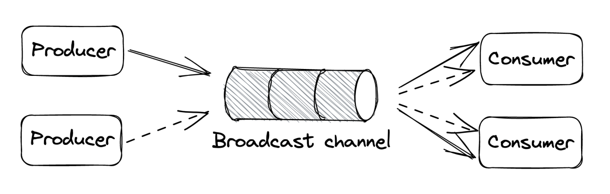

# Scalability
* [HTTP Caching](#http-caching)
* [Content Delivery Networks](#content-delivery-networks)
* [Partitioning](#partitioning)
* [File Storage](#file-storage)
* [Network Load Balancing](#network-load-balancing)
* [Data Storage](#data-storage)
* [Caching](#caching)
* [Microservices](#microservices)
* [Control Planes and Data Planes](#control-planes-and-data-planes)
* [Messaging](#messaging)
* [Summary](#summary)

Over the last decades, the number of people with internet access has risen. This lead to the need for businesses to handle millions of concurrent users. To scale, an application must run without performance degradation. The only long-term solution is to scale horizontally.

This part focuses on scaling a small CRUD application:
* REST API
* SPA Javascript font-end
* Images are stored locally on the server
* Both database and application server are hosted on the same machine - AWS EC2
* Public IP Address is managed by a DNS service - AWS Route53


Problems:
* Not scalable
* Not fault-tolerant

Naive approach to scaling is to scale up by adding more CPU, RAM, Disk, etc. Better alternative is to scale out for ex: move the database to a dedicated server.


This increases the capacity of both the server and the database. This technique is called *functional decomposition* - application is broken down to independent components with distinct responsibilities.

Other approaches to scaling:
* Partitioning - splitting data into partitions and distributing it among nodes.
* Replication - replicating data or functionality across nodes.

The following sections explore different techniques to scale

## HTTP Caching

Cruder handles static and dynamic resources:
* Static resources don't change often: HTML, CSS, JS files
* Dynamic resources can change for ex: a user's profile JSON

Static resources can be cached since they don't change often. A client (ex browser) can cache the resource so that subsequent access doesn't make network calls to the server. We can leverage HTTP Caching, which is limited to GET and HEAD HTTP methods. The server issues a `Cache-Control` header which tells the browser how to handle the resource:


The max-age is the TTL of the resource and the ETag is the version identifier. The age is maintained by the cache and indicates for how long the resource been cached. If a subsequent request for the resource is received, the resource is served from the cache as long as it is still fresh - TTL hasn't expired. If, however, the resource has changed on the server in the meantime, clients won't get the latest version immediately.

Reads, therefore, are not strongly consistent. If a resource has expired, the cache will forward a request to the server asking if it's change. If it's not, it updated its TTL:


One technique we can use is treating static resources as immutable. Whenever a resource changes, we don't update it. Instead, we publish a new file(with version tag) and update references to it. This has the advantage of atomically changing all static resources with the same version. 

Put another way, with HTTP Caching, we're treating the read path differently from the write path because reads are way more common than writes. This is referred to as Command-Query Responsibility Segregation(CQRS) Pattern.

### Reverse Proxies

An alternative is to cache static resources on the server-side using reverse proxies. A reverse proxy is a server-side proxy which intercepts all client calls. It is indistinguishable from the actual server, therefore clients are unaware of its presence.


A common use-case for reverse proxies is to cache static resources returned by the server. Since this cache is shared among clients, it will reduce the application server's burden.

Other use-cases for reverse proxies:
* Authenticate requests on behalf of the server.
* Compress a response before forwarding it to clients to speed up transmission speed.
* Rate-limit requests coming from specific IPs or users to protect the server from DDoS attacks.
* Load-balance requests among multiple servers to handle more load.

NG-INX and HAProxy are popular implementations which are commonly used. However, caching static resources is commonized by manages services such as Content Delivery Networks (CDNs) so we can just leverage those.

## Content Delivery Networks

CDN - overlay network of geographically distributed caches (reverse proxies), designed to work around the network protocol. When you use CDN, clients hit URLs that resolve to the CDN's servers. If a requested resource is stored in there, it is given to clients. If not, the CDN transparently fetches it from the origin server. Well-known CDNs - Amazon CloudFront and Akamai.\

### Overlay Network

The main benefit of CDNs is not caching. It's main benefit is the underlying network architecture. The internet's routing protocol - BGP, is not designed with performance in mind. When choosing routes for a package, it takes into consideration number of hops instead of latency or congestion. 

CDNs are built on top of the internet, but exploit techniques to reduce response time and increase bandwidth. It's important to minimize distance between server and client in order to reduce latency. Also, long distances are more error-prone. This is why clients communicate with the CDN server closest to them. One way to achieve that is via DNS load balancing - a DNS extension which infers a client's location based on its IP and returns a list of geographically closest servers. CDNs are also placed at internet exchange points - network nodes where ISPs intersect. This enables them to short-circuit communication between client and server via advanced routing algorithms. These algorithms take into consideration latency and congestion based on constantly updated data about network health, maintained by the CDN providers. In addition to that, TCP optimizations are leveraged - ex: pooling TCP connections on critical paths to avoid setting up new connections every time.


| Feature | What It Means | Why It Matters |
|---------|---------------|----------------|
| **GeoDNS / Anycast** | Routes user to nearest node based on IP. | Lower latency & packet loss. |
| **Private Backbone** | CDN runs its own fiber network. | Predictable, faster routing. |
| **Internet Exchange Points (IXPs)** | Edge nodes at ISP intersections. | Fewer middleman hops. |
| **TCP / QUIC Optimizations** | Keep TCP open, use HTTP/3 over QUIC. | Less handshake overhead. |
| **Smart Routing** | Algorithms pick fastest path in real time. | Avoids congestion & outages. |
| **Edge Computing** | Code runs on edge nodes (e.g., Cloudflare Workers). | Dynamic processing near the user. |


Apart from caching, CDNs can be leveraged for transporting dynamic resources from client to server for it's network transport efficiency. This way, the CDN effectively becomes the application's frontend, shielding servers from DDos attacks.

#### The Key Mental Model
* Without a CDN:
  * Your request follows the default internet path chosen by BGP, which is like a taxi driver who only cares about fewest turns, not fastest route.
* With a CDN:
  * Your request first jumps to the nearest edge (local onramp). 
  * If needed, it travels through the CDN’s private, optimized highway system. 
  * It exits near your origin or the cached data location.

### Caching
CDNs have multiple caching layers. The top ones is at edge servers, deployed across different geographical regions. Infrequently accessed content might not be available in edge servers, hence, it needs to be fetched from the origin using overlay network for efficiency. 

There is a trade-off though - more edge servers can reach more clients, but reduce the cache hit ration. Why? More servers means you'll need to "cache hit" a content in more locations, increasing origin server load. To mitigate this, there are intermediary caching layers, deployed in fewer geographical regions. Edge servers first fetch content form there, before going to the origin server.

Example:
* If you only have 3 edge servers worldwide, each one gets lots of traffic for the same files → those files stay in cache. 
* If you suddenly add 300 edge servers, each one serves a much smaller local audience. 
  * That means each file might be requested less often at each edge. 
  * If it's rarely requested, it might expire or get evicted from cache before the next request. 
  * Result → More requests fall back to origin → origin load increases.
    
  [Client] → [Edge Server] → [Mid-Tier Regional Cache] → [Origin]

Finally, the CDNs are partitioned - there is no single server which holds all the data as that's infeasible. It is dispersed across multiple servers and there's an internal mechanism which routes requests to the appropriate server, which contains the target resource.

## Partitioning

When an application data grows, at some point it won't fit in a single server. That's when partitioning can come in handy - splitting data(shards) across different servers. An additional benefit is that the application's load capacity increases since load is dispersed across multiple servers vs a single one. When a client makes a request to a partitioned system, it needs to know where to route the request. Usually, a gateway service (reverse proxy) is in charge of this. Mapping of partitions to servers is usually maintained in a fault-tolerant coordination service such as zookeeper or etcd.


Partitioning, unfortunately, introduces a fair amount of complexity:
* Gateway service is required to route requests to the right nodes
* Data might need to be pulled from multiple partitions and aggregated (ex joins across partitions)
* Transactions are needed to atomically update data across multiple partitions, which limits scalability.
* If a partition is much more frequently accessed than others, it becomes a bottleneck, limiting scalability.
* Adding/removing partitions at runtime is challenging because it involves reorganizing data.

Cache are ripe for partitioning as they:
* don't need to atomically update data across partitions
* don't need to join data across partitions as caches usually store key-value pairs
* losing data due to changes in partition configuration is not critical as caches are not the source of truth.

In terms of implementation, data is distributed using two main mechanisms - hash and range partitioning. An important prerequisite for partitioning is for partitioning is for the number of possible keys be very large. Ex: a boolean key is not appropriate for partitioning.

### Range Partitioning


With this mechanism, data is split in lexicographically sorted partitions. To make range scanning easier, data within a partition is kept in sorted order on disk.

Challenges:
1. Uneven Key Distribution
   * Not all letters or values are equally used
   * Ex: in English, "S" and "T" are more common than "Q" -> some partitions become huge, others tiny -> **load imbalance**
2. Hotspots
   * If partitioning by date, everyone querying "today" will hit the same partition.
   * **Workaround**: add random prefixes to keys(ex "3|2025-08-13") so hot data is spread, but increase query complexity
3. Rebalancing
   * Data grows -> split partitions
   * Data shrinks -> merge partitions
   * Need to minimize data movement to reduce downtime and network load.

Solutions
* Static Partitioning
  * Create **many partitions from the start**
  * Each node serves multiple partitions
  * Pros: Easy to reason about
  * Cons:
    * Partition size fixed -> can't adapt to growth/shrink
    * Trade-off:
      * **To many partitions** -> overhead in managing them, slower queries
      * **To few partitions** -> scalability limit
* Dynamic Partitioning
  * Start small(even one partition)
  * Split or merge **as data changes**
  * Example:
    * Split a large range into two subranges if it grows too big
    * Merge two small partitions if they shrink
  * Pros: Adapt automatically
  * Cons: More complex implementation

Why it's powerful: Range partitioning makes range queries fast because you can skip entire partitions that don't match your query. But... balancing them and avoiding hotspots is the real art.

### Hash Partitioning
Use a hash function which deterministically maps a key to a seemingly random number, which is assigned to a partition. Hash functions usually distribute keys uniformly.


```
hash("Alice") → 812  
812 % 4 partitions = Partition 0

hash("Bob") → 143  
143 % 4 partitions = Partition 3
```

Challenge - assigning hashes to partitions:
* Naive approach - use the module operator. Problem - rebalancing means moving almost all the data around.
  * If you simply use: `partition = hash(key) % num_partitions` then changing `num_partitions` changes the result for almost every key
* Better approach - consistent hashing

How consistent hashing works:
* partitions and keys are randomly distributed in a circle.
* each key is assigned to the closest partition which appears in the circle in clockwise order.


Adding a new partition only rebalances the keys which are now assigned to it in the circle:


Main drawback of hash partitioning - sorted order is lost. This can be mitigated by sorting data within a partition based on a secondary key.

## File Storage
Using CDNs enables our files to be quickly accessible by clients. However, our server will run out of disk space as the number of files we need to store increases. To work around this limit, we can use a managed file store such as AWS S3 or Azure Blob Storage. Managed file stores scalable, high available and offer strong durability guarantees. In addiction to that, managed file stores enable anyone with access to its URL to point to it, meaning we can point out CDNs to the file store directly.

### Blob Storage Architecture
This section explores how distributed blob stores work under the hood by exploring the architecture of Azure Storage. Side note - AS works with files, tables and queues, but discussion is only focused on the file(blob) store.

AS Architecture in a nutshell:
* Composed of different racks of clusters, which are geographically distributed. Each node in a cluster has separate network and (redundant) power supply.
* file URL are composed of account name + file name - https://{account_name}.blob.core.windows.net/{filename}
* Customer sets up account name and AS DNS uses that to identify the storage cluster where the data is located. The filename is used to detect the correct node within the cluster.
* A location service acts as a control plane, which creates accounts and allocates them to clusters.
  * Creating a new account leads to the location service:
    1. choosing an appropriate cluster
    2. updating the cluster configuration to accept requests for that account name
    3. updates the DNS records
* The storage cluster itself is composed of a front-end, partition and stream layers


Stream Layer
* What it is: The actual distributed append-only file system. 
* How it stores data:
  * Data lives in streams (logical files). 
  * Each stream = sequence of extents (chunks of data). 
  * Chain replication: Extents are stored on multiple servers in a chain (good for strong consistency). 
* Control plane: Stream Manager 
  * Assigns extents to chain-replica servers. 
  * Handles failures (missing replicas).

Partition Layer
* What it is: The brains that map file names → low-level storage operations. 
* Main jobs:
  * Maintain an index of all files in the cluster. 
  * Range partition this index across multiple servers. 
  * Split/merge partitions dynamically for load balancing. 
  * Handle replication across clusters (for disaster recovery and load balancing). 


* Control plane: Partition Manager 
  * Decides how to split/merge partitions. 
  * Tracks where each file’s index entry lives.


Front-End Layer
* What it is: Stateless reverse proxy servers. 
* Role:
  * Authenticate requests. 
  * Route them to the correct partition server. 
* Key point: Does no data storage; purely routing + authentication.

Key Takeaways
* Strong consistency from day one (unlike S3). 
* Layered architecture:
  * Front-End → Partition Layer → Stream Layer. 
* Two levels of control planes:
  * Global (Location Service). 
  * Per-layer (Partition Manager, Stream Manager). 
* Chain replication in the stream layer = consistency + fault tolerance.

## Network Load Balancing

So far we've scaled by offloading files into a dedicated file storage service + leveraging CDN for caching and its enhances networking. However, we still have a single application server. To avoid this, we can instantiate multiple application servers hidden behind a load balancer, which routes requests to them, balancing the load on each. This is possible because the application server is stateless. State is encapsulated within the database and file store. Scaling out stateful application is a lot harder as it requires replication and coordination.

General rule - push state to dedicated services, which are stable and highly efficient. The load balancer will also track our application's health and stop routing requests to faulty servers. This leads to increased availability.

Availability == probability of a valid request succeeding

How is theoretical availability calculated? 
```
Availability= 1 − (product of failure rates)
Ex: 2 servers with 99% availability: 1 - (0.01 * 0.01) = 99.99%
```

Caveats:
* Detection delay: load balancer needs time to notice a crash.
* Failure correlation: failures often aren't independent.
* Removing a node can overload others.

### Load Balancing

| Algorithm          | How it works                                 | Pros                      | Cons                                        |
|--------------------|----------------------------------------------|---------------------------|---------------------------------------------|
| Round Robin        | Requests cycle through servers in sequence   | Simple, often good enough | Doesn't consider load differences           |
| Consistent Hashing | Requests go to a server based on hashing key | Good for sticky sessions  | More complex                                |
| Least Loaded       | Sends requests to least busy server          | Can be fairer             | Risk of overloading if measurement is stale |

In practice, round robin achieves better results than load distribution. However, [an alternative algorithm](https://brooker.co.za/blog/2012/01/17/two-random.html) which randomizes requests across the least loaded servers achieves better results.

### Service Discovery
This is the process load balancers use to discover the pool of servers under your application identifier.

Approaches:
* (naive) Maintain a static configuration file mapping application to list of IPs. This is painful to maintain.
* Dynamic Registry(Zookeeper, etcd) to maintain the latest configuration

Adding/removing servers dynamically is a key functionality for implementing autoscaling, which is supported is most cloud providers.

### Health Checks
Load balancers use health checks to detect faulty servers and remove them from pool.

Types of health check:
* Passive - health check is piggybacked on top of existing requests. Timeout or status 503 means the server is down and it is removed.
* Active - servers expose a dedicated `health` endpoint and load balancer actively polls it
  * This can work by just returning OK or doing a more sophisticated check of the server's resources(ex DB connection, CPU load, etc.)
  * **Important note** a bug in the `/health` endpoint can bring the whole application down. Some smart load balancers can detect this anomaly and disregard the health check

Health checks can be used to implement rolling updated - updating the application to a new version without downtime:
* During the update, a number of servers report as unavailable
* In-flight requests are completed(drained) before servers are restarted with the new version.

This can also be used to restart for example a degraded server due to (for example) a memory leak:
* A background thread(watchdog) monitors a metric(ex memory) and if it goes beyond a threshold, server forcefully crashes.
* The watchdog implementation is critical - it should be well tested because a bug can degrade the entire application.

### DNS Load Balancing

A simple way to implement a load balancer is via DNS. We add the servers public IPs as DNS records and clients can pick one:


The main problem is the lack of fault tolerance - if one of the servers goes down, the DNS server will continue routing requests to it. Even if an operator manages to reconfigure the DNS records, it takes time for the changes to get propagated due to DNS caching.

The one use-case where DNS Load Balancing is used is to route traffic across multiple data centers.

### Network Load Balancing
A more flexible approach is implementing a load balancer, operating at the TCP layer of the network stack
* Network Load Balancers have one or more physical network cards mapped to virtual IPs(VIPs). A VIP is associated with a pool of servers.
* Clients only see the VIP, exposed by the load balancer.
* The Load Balancer routes client requests to a server from the pool, and it detects faulty servers using passive health checks
* The Load Balancer maintains a separate TCP connection to the downstream server. This is called TCP termination.
* Direct server return is an optimization where responses bypass the L4 load balancer and go to the client directly.
* Network Load Balancers are announced to a data center's router, which can load balance requests to the Network Load Balancers.


Managed solutions for network lead balancing:
* AWS Network Load Balancer
* Azure Load Balancer

Load balancing at the TCP layer is very fast, but it doesn't support features involving higher-level protocols such as TLS termination.

TLS termination means the load balancer decrypts HTTPS traffic so it can:
* Inspect HTTP headers
* Apply routing rules(ex send `/images` to one service, `/api` to another)
* Add security features (WAF, authentication, etc.)

Bur at the TCP layer, the load balancer never sees HTTP headers - it just moves encrypted bytes around without knowing what they mean. To terminate TLS, you need a **Layer 7 Load Balancer** that understands application protocols like HTTP/S.

Analogy: Think of Layer 4 like a postal sorting machine that only looks at the address on an envelope - it's very fast, but can't open the main to check what's inside. TLS termination is like opening the envelope to read the contents before forwarding - that's Layer 7 work.

### Application layer load balancing
Application layer load balancers(aka Layer 7 Load Balancers) are HTTP reverse proxies which distribute requests over a pool of servers. There are two TCP connections at play:
1. Between client and Load Balancer
2. Between Load Balancer and  origin server.

Feature L7 Load Balancer support:
* Multiplexing multiple HTTP connections over the same TCP connection
* Rate limiting HTTP requests
* Terminate TLS connections
* Sticky sessions - routing requests belonging to the same session onto the same server (ex by reading a cookie)

Drawbacks:
* Much lower throughput than L4 Load Balancers
* If a Load Balancer goes down, the application behind it goes down as well.

One way to off-load requests from an application load balancer is to use the sidecar proxy pattern. This can be applied to clients internal to the organization. Applications have a L7 load balancer instance running on the same machine. All application requests are routed through it. This is also referred to as a service mesh. Popular sidecar proxy load balancers: NGINX, HAProxy, Envoy.

Main advantage: delegates load balancing to the client, avoiding a single point of failure
Main disadvantage: there needs to be a control pane which manages all the sidecars.

## Data Storage
The next scaling target is the database. Currently, it's hosted on a single server.

### Replication
We can increase the read capacity of the database by using leader-follower replication:


Clients send writes to the leader.The leader persists those in it's write-ahead log. Replicas connect to the header and stream log entries from it to update their state. They can disconnect and reconnect at any time as they maintain the log sequence number they've reached, from which they continue the stream.

This helps with:
* Increasing read capacity
* Increasing database availability
* Expensive analytics queries can be isolated to a follower in order to not impact the rest of the clients

Replication can be configured as:

| Mode                                        | What Happens                                                                                                          | Pros                                                                                            | Cons                                                             |
|---------------------------------------------|-----------------------------------------------------------------------------------------------------------------------|-------------------------------------------------------------------------------------------------|------------------------------------------------------------------|
| Fully synchronous                           | Leader sends write to all required synchronous replicas, waits for their acknowledgments, then responds to the client | Strong consistency, no data loss if leader fails(as long as a synchronous replica is available) | High latency - slowest replica dictates performance              |
| Fully asynchronous                          | Leader acknowledges the write to the client before followers confirm. Followers replicate in the background.          | Low latency, high throughput                                                                    | Can lose data if leader fails before replication finishes.       |
| Hybrid/Semi-synchronous(default PostgreSQL) | Leader waits for acknowledgement from at least one synchronous replica, others replicate asynchronously               | Good compromise between latency and durability                                                  | Sightly slower than fully async, but much faster than fully sync |

Replication increases read capacity, but it still requires the database to fit on a single machine. Replication is not the same as sharding; it duplicates the same data, so storage limits are still bound by a single machine.

### Partitioning 
Enables us to scale a database for both reads and writes. Traditional relational databases, don't support partitioning out of the box, so we can implement it in the application layer.

In practice, this is quite challenging:
* We need to decide how to split data to be evenly distributed among partitions
* We need to handle rebalancing when partition becomes too hot or too big.
* To support atomic transactions, we need to add support fot two-phase commit(2PC)
* Queries spanning multiple partitions need to be split into sub-queries(ex aggregations, joins)

Fundamental problem of relational databases is that they were designed under the assumption that they can fit on a single machine. Due to that, hard-to-scale features such as ACID and joins were supported. In addition to that, relational databases were designed when disk space was costly, so normalizing the data was encouraged to reduce disk footprint. This came at a significant cost later to unnormalize the data via joins. 

Times have changed - storage is cheap, but CPU time isn't. Since 2000, large tech companies have started to invest in data storage solutions, designed with high availability and scalability in mind.

### NoSQL
Some of the early designs were inefficient compared to traditional SQL databases, but the Dynamo and Bigtable papers were foundational for the later growth of these technologies. 

Modern NoSQL database systems such as HBase and Cassandra are based on them. Initially, NoSQL databases didn't support SQL, but nowadays, they support SQL-like syntax. 

Traditional SQL systems support strong consistency models, while NoSQL databases relax consistency guarantees (ex eventual/causal consistency) in favor of high availability. NoSQL systems usually don't support joins and rely on the data being stored unnormalized. Main NoSQL flavors store data as key-value pairs or as document store. The main difference is that the document store enables indexing on internal structure. A strict schema is not applied in both cases. 

Since NoSQL databases are natively created with partitioning in mind, there is limited(if any) support for transactions. However, due to data being stored in unnormalized form, there is less need for transactions or joins. A very bad practice is try to store a relational model in a NoSQL database. This will result in the worst of both worlds. If used correctly, NoSQL can handle most of the use-cases a relational database can handle, but with scalability from day one. The main prerequisite for using NoSQL database is to know the access patterns beforehand and model the database with those in mind since NoSQL databases are hard to alter later.

For example, let's take a look at DynamoDB:
* A table consists of items. Each table has a partition key and optionally a sort key (aka clustering key)
* The partition key dictates how data is partitioned and distributed among nodes.
* The clustering key dictates how the data is sorted within partitions - this enables efficient range queries.
* DynamoDB maintains three replicas per partition which are synchronized using state machine replication.
* Writes are routed to the leader. Acknowledgment is sent once 2 out of 3 replicas have received the update
* Reads can be eventually consistent(if you query any replica) or strongly consistent(if you query the leader).

DynamoDB's API supports:
* CRUD on single items
* Querying multiple items with the same partition key and filtering based on the clustering key
* Scanning the entire table.

Joins aren't supported by design. We should model our data to not need joins in the first place. 

Example - modeling a table of orders:
* We should model the table with access patterns in mind. Let's say the most common operation is grabbing orders of a customer, sorted by order creation time.
* Hence, we can use the customer ID as the partition key and the order creation time as the clustering key.


SQL databases require that you store a given entity type within a single table. NoSQL enables you to store multiple entity types within the same table. Ex: if we want to also include a customer's full name in an order, we can add a new entry against the same partition key within the same table:


A single query can grab both entities within this table, associated to a given customer, because they're stored against the same partition key.

More complex access patterns can be modeled via secondary indexes, which is supported by DynamoDB:
* Local secondary indexes allow for more sort keys within the same table
* Global secondary indexes enable different partition and sort keys, with the caveat that index updates are asynchronous and eventually consistent.

Main drawback of NoSQL databases - much more thought must be put upfront to design the database with the access patterns in mind. Relational databases are much more flexible, enabling you to change your access patterns at runtime. To learn more about NoSQL databases, the author recommends [The DynamoDB Book](https://www.dynamodbbook.com/), even if you plan to use a different NoSQL database. 

The latest trend is to combine the scalability of NoSQL databases with the ACID guarantees of relational databases. This trend is referred to as NewSQL. NoSQL databases favor availability over consistency in the event of network partitions. NewSQL prefer consistency. The argument is that with the right design, the reduction of availability due to preferring strong consistency is barely noticeable. CockroachDB and Spanner are well-known NewSQL databases.

| Feature           | SQL (Relational)             | NoSQL (Non-relational)         | NewSQL                     |
|------------------|------------------------------|-------------------------------|----------------------------|
| **Data Model**    | Tables with fixed schema     | Key-value, Document, Column, Graph | Tables with fixed schema   |
| **Schema**        | Rigid, predefined            | Flexible / Schema-less        | Rigid, predefined          |
| **Transactions**  | ACID                         | Often eventual consistency; some support ACID | ACID                     |
| **Scalability**   | Vertical scaling             | Horizontal scaling            | Horizontal scaling         |
| **Consistency**   | Strong                       | Tunable: eventual, strong, or causal | Strong                   |
| **Joins**         | Supported                    | Rare or limited               | Supported                  |
| **Performance**   | Can degrade at massive scale | High performance for large distributed datasets | High performance at scale with ACID |
| **Examples**      | MySQL, PostgreSQL, Oracle    | MongoDB, Cassandra, DynamoDB  | Google Spanner, CockroachDB, Amazon Aurora |

## Caching
Whenever a significant portion of requests is for a few frequently accessed objects, then that workflow is suitable for caching. 

Caches improves the app's performance and reduces the load on the data store:
* It's a high-speed storage layer that buffers responses from the origin data store
* It provides best-effort guarantees since it isn't the source of truth. it's state can always be rebuilt from the origin.

In order for a cache to be cost-effective, the proportion of requests which hit the cache vs hitting the origin should be high(hit ratio)

The hit ratio depends on:
* The total number of cacheable objects - the fewer, the better
* The probability of accessing the same object more than once - the higher, the better
* The size of the cache - the larger, the better

The higher in the call stack a cache is, the more objects it can capture. Be wary, though, that caching is an optimization, which doesn't make a scalable architecture. Your original data store should be able to withstand all the requests without a cache in front of it. It's acceptable for the request to become slower, but it's not acceptable for your entire data store to crash.

### Policies
Whenever there's a crache miss, the missing object has to be requested from the origin.

There are 2 ways(policies) to handle this:
* Side Cache - The application requests the object from the origin and store it in the cache. The cache is treated as a key-value store.
* Inline Cache - The cache communicated with the origin directly requesting the missing object on behalf of the application. The app only accesses the cache.

Side cache(write-through-aside) example:


Inline cache (aka write-through) example:


Something which wasn't mentioned in the book is a write-back cache. It acts as a write-through cache, but asynchronously updates the data store. This one is way more complex to implement:


Whenever the cache has limited capacity, entries must be evicted from it. The eviction policy defines that. The most common eviction policy is LRU - least-recently used elements are evicted first. The expiration policy defines how long objects stored in the cache before they're refreshed from the origin(TTL). The higher the TTL, the higher the hit ratio, but also the higher the chance of serving stale objects. Eviction need not occur immediately. It can be deferred to the next time an object is accessed. This might be preferable so that if the origin data store is down, your application continues returning data albeit stale.

Cache invalidation - automatically expiring objects when they change, is hard to implement in practice. That's why TTL is used as a workaround.

### Local Cache
Simplest way to implement a cache is to use a library (Guava in Java or RocksDB), which implements an in-memory cache. This way, the cache is embedded within the application.


Different replicas have different caches, hence objects are duplicated and memory is wasted. These kind of caches also cannot be partitioned or replicated - if every client has 1GB of cache, then the total capacity of the cache is 1GB. 

Consistency issues will also arise - separate clients can see different versions of an object. More applications replicas mean more caches, which result in more downstream traffic towards the origin data store. This issue particularly prevalent when the application restarts., caches are empty and the origin is hit with a lot of concurrent requests. Same thing can happen if an object instantly becomes popular and becomes requested a lot. This is referred to as "thundering herd". You can reduce its impact by client-side rate limiting.

### External Cache
External service, dedicated to caching objects, usually in-memory for performance purposes. Because it's shared, it resolves some of the issues with the local caches at the expense of greater complexity and cost. Popular external caches: Redis and Memcached. 

External Caches can increase their throughput and size via replication and partitioning - Redis does this, for example. Data can automatically partition data also replicate partitions using leader-follower election.

Since cache is shared among clients, they consistently see the same version of an object - be it stale or not. Replication, however, can lead to consistency issues. The number of requests towards the origin doesn't grow in application instances.


External caches move the load from the origin data store towards itself. Hence, it will need to be scaled out eventually. When that happens, as little data should be moved around as possible to avoid having the hit ratio drop significantly. Consistent hashing can help here.

Other drawbacks of external caches:
* Maintenance cost - in contrast to local caches, external ones are separate service which need to be setup and maintained
* Higher latency than local caches due to the additional network calls.

If the external cache is down, how can clients mitigate that? One portion is to bypass it and access the origin directly, but that can lead to cascading failures due to the origin not being able to handle the load. Optionally, applications can maintain an in-process cache as a backup in case the external cache crashes.

#### Latency & Trade-offs: Local Cache vs External Cache vs Database

| Tier               | Typical Latency   | Pros                                                                 | Cons                                                                 |
|--------------------|-------------------|----------------------------------------------------------------------|----------------------------------------------------------------------|
| **Local Cache**    | ~0.1–1 µs         | - Fastest possible (in-memory, no network) <br> - No external service to maintain | - Memory is per-process (no sharing) <br> - Can become stale quickly <br> - Limited by process memory size |
| **External Cache** | ~0.5–2 ms         | - Shared across processes and servers <br> - Still much faster than DB <br> - Can store more data than fits in one process | - Requires network hop (slower than local) <br> - Separate service to deploy & maintain |
| **Database**       | ~5–100+ ms        | - Source of truth <br> - Can handle complex queries & joins | - Slowest tier <br> - Higher load if caching is ineffective |

#### Visual Hierarchy of Speed
      Fastest
       ▲
       │   Local Cache
       │
       │   External Cache
       │
       │   Database
       ▼
     Slowest

## Microservices

A monolithic application consists of a single code base with multiple independent components in it:


Downsides of a monolithic system:
* Components will become increasingly coupled over time and devs will step on each others toes quite frequently
* The code base at some point will become too large for anyone to fully understand it - adding new features or fixing bugs becomes more time-consuming that it used to.
* A change in a component leads to the entire application being rebuild and redeployed.
* A bug in one component can impact multiple unrelated components - ex memory leak.
* Reverting a deployment affects the velocity of all developers, not just the one who introduced a bug.

To mitigate this, one could functionally decompose the large code base into a set of independently deployable services, communicating via APIs:


The decomposition creates a boundary between components which is hard to violate, unlike boundaries within a code base.

Outcome of using microservices:
* Each service is owned and operated by a small team - less communication is necessary across teams.
* Smaller teams communicate more effectively than larger ones, since communication overhead grows quadratically as team size increases.
* The surface area of an application is smaller, making it more digestible to engineers.
* Teams are free to adopt the tech stack and hardware they prefer.

Good practices:
* An API should have a small surface area, but encapsulate a significant amount of functionality.
* Services shouldn't be too "micro" as that adds additional load and complexity

### Caveats
Splitting your application into multiple services has benefits, but it also has a lot of downsides. It is only worth paying the price if you'll be able to amortize it across many development teams.
1. Tech Stack
  * Nothing forbids teams from using a different tech stack than everyone else. Doing so, makes it difficult to developers to move across teams.
  * In addition to that, you'll have to support libraries in multiple languages for your internal tools.
  * It's reasonable to enforce a certain degree of standardization. One way of doing this is to provide a great developer experience for some technologies, but not to others.
2. Communication
   * Remote calls are expensive and non-deterministic. Making them within the same process removes a lot of the complexity of distributed systems.
3. Coupling
   * Microservices ought to be loosely coupled. Changes in one service shouldn't propagate to multiple other services. Otherwise, you end up with a distributed monolith, which has the downsides of both approaches.
   * Examples of tight coupling:
     * Fragile APIs require clients to be updated on every change.
     * Shared libraries which have to be updated in lockstep across multiple services.
     * Using static IP addresses to reference external services.
4. Resource provisioning
   * It should be easy to provision new services with dedicated hardware, data stores, etc. 
   * You shouldn't make every team do things in their own(slightly different) way.
5. Testing
   * Testing microservices is harder than testing monoliths because subtle issues can arise from cross-service intergrations.
   * To have gigh confidence, you'll have to develop sophisticated integration testing mechanisms.
6. Operations
   * Ease of deployment is critical so that teams don't deploy their services differently.
   * In addition to that, debugging microservices is quite challenging locally so you'll need a sophisticated observability platform.
7. Eventual Consistency
   * The data model no longer resides in a single data store. Hnece, atomic updated across a distributed system, is more challenging. Additionally, guaranteeing strong consistency has a high cost which is often not worth paying so we fallback to eventual consistency.

Conclusion: It is usually best to start with a monolith and decompose it once there's a good enough reason to do so. Once you start experiencing growing pains, you can start to decompose the monolith, one microservice at a time.

| Aspect | Monolith | Microservices |
|--------|----------|---------------|
| **Scaling unit** | The whole application scales together. Even if only one part (like payment processing) needs more resources, you must scale the entire monolith. | Each service can scale independently. Only the heavily used services need more instances. |
| **Deployment** | Scaling often requires deploying the full application multiple times. | Each service can be deployed and scaled independently, reducing overhead. |
| **Fault isolation** | A problem in one module can affect the whole app. | Failures are contained within a single service. Other services keep running. |
| **Complexity** | Simple architecture, easier for small apps. But large monoliths become complex and hard to change/scale. | More complex architecture (networking, service discovery, communication), but easier to scale horizontally. |
| **Resource efficiency** | Inefficient — scaling one part wastes resources on the rest of the monolith. | Efficient — only scale the parts that need it. |
| **Pros** | Easier to develop, test, and deploy initially. Less overhead in terms of infrastructure. | Flexible scaling, fault isolation, better for large teams, and continuous deployment. |
| **Cons** | Harder to scale horizontally, changes affect the entire app, long build and deploy cycles for large apps. | Operational complexity, harder to test end-to-end, network overhead, need for monitoring and service discovery. |

### API Gateway
When using microservices, letting clients make requests to services can be costly. For example, mobile devices might have a hard time performing an expensive operation which involves interacting with multiple APIs as every API call consumes battery life. In addition to that, clients need to be aware of implementation details such as a service's name. This makes it hard to modify the application architecture as it requires changing the clients as well. Once you have a public API out, you have to be prepared to maintain it for a very long time. 

As a solution, we can hide the internal APIs behind a facade called API gateway.


Here are some of the core responsibilities:

#### Routing
You can map public endpoints to internal ones. If there is a 1:1 mapping, the internal endpoint can change, but the public one can stay the same.

#### Composition
We might encounter use-cases where we have to stitch data together from multiple sources. The API Gateway can offer high-level API that composes a response from the data of multiple services. This relieves the client from knowing internal service details and reduces the number of calls it has to perform to get the data it needs. Be wary that the availability of an API decreases as the number of composed internal services increases.

#### Translation
The Api Gateway can transform from one IPC mechanism to another - ex gRPC to REST. Additionally, it can expose different APIs to different clients. Ex a desktop-facing API can include more data than a mobile-facing one. 

Graph-based APIs are popular mechanism to allow the client to decide for itself how much data to fetch - GraphQL is a popular implementation. This reduces development time as there is no need to introduce different APIs for different use-cases.

#### Cross-cutting concerns
Cross-cutting functionality can be off-loaded from specific services - ex caching static resources or rate-limiting.

The most critical cross-cutting concerns are authentication and authorization. A common way to implement those, is via sessions - objects passed through by client in subsequent requests. Those store a cryptographically secure session object, which the server can read and for ex extract a user id.

Authentication is best left to the API Gateway to enable multiple authentication mechanisms into a service, without it being aware. Authorization is best left to individual services to avoid coupling the API Gateway with domain logic. The API gateway passes through a security token into internal services. They can obtain the user identity and roles via it.

Tokens can be:
* Opaque - services call an external service to get the information they need about the user.
* Transparent - the token contains the user information within it.

Opaque tokens require an external call, while transparent ones save you from it, but it harder to revoke them if they're compromised. If we want to revoke transparent tokens, we'll need to store them in a "revoked_tokens" store or similar. The most popular transparent token standard is JWT - json payload with expiration date, user identity, roles, metadata. The payload is signed via a certificate, trusted by internal services. Another popular auth mechanism is using API keys - popular for implementing third-party APIs.

#### Caveats
The API Gateway has some caveats:
* It can become a development bottleneck since it's tightly coupled with the internal APIs its proxying to.
* Whenever an internal API changes, the API gateway needs to be changed as well
* It needs to scale to the request rate for all the services behind it.

If an application has many services and APIs, an API gateway is usually a worthwhile investment.

How to implement it:
* Build it in-house, using a reverse proxy as a starting point (ex NGINX)
* Use a managed solution, ex Azure API Management, Amazon API Gateway

## Control Planes and Data Planes
The API Gateway is a single point of failure. If it goes down, so does out application. Hence, this component should be scalable and highly available. There are some challenges related to external dependencies - ex gateway has a "configuration" endpoint which updates your rate-limits for endpoints. This endpoint has a lot less load than normal endpoints. In those cases, we should favor availability vs consistency. In this case we should favor consistency. 

### Why split the API Gateway?
* The API Gateway is on the critical path for every client request. 
* Some functionality is highly critical (like routing requests) → must be fast, highly available, and scalable. 
* Other functionality is non-critical (like updating rate-limits or configuration) → can tolerate delays → consistency is more important than speed.

Solution: Split into two planes:
1. Data Plane → handles external client requests. 
2. Control Plane → manages configuration, metadata, rate-limits, etc.

This separation allows each plane to have different scaling and availability strategies.

### Data Plane Characteristics
* Critical path for client requests → must never block. 
* Needs high availability → must continue serving requests even if parts of the system fail. 
* Scales horizontally to handle load. 
* Should cache configuration locally and operate with the last known state if the control plane is temporarily unavailable.

### Control Plane Characteristics
* Not on the critical path → can be slower. 
* Manages configuration for the data plane. 
* Can be split further into multiple control planes:
  * One for auto-scaling services 
  * One for rate-limit management 
* Needs consistency more than extreme availability.

### Hard Dependencies and Availability
* If the data plane depends directly on the control plane, a control plane failure can crash the data plane → this is a hard dependency. 
* Multiple dependent components reduce overall availability:
  * Theoretical availability = product of independent availabilities. 
  * Example: Two components each 50% available → system = 0.5 × 0.5 = 25% available. 
* To avoid this: data plane should continue running with cached/last-seen configuration, instead of blocking or crashing.

| Concept                     | Best Practice                                                                 |
|-----------------------------|------------------------------------------------------------------------------|
| Critical path handling       | Implement in **data plane**, must be fast and highly available               |
| Configuration & management   | Implement in **control plane**, consistency prioritized                      |
| Multiple control planes      | Improves modularity but introduces complexity; **data plane must be resilient** to failures |
| Hard dependencies            | Avoid direct coupling; use **cached state or fallback** mechanisms          |
| Overall availability         | Design so that data plane **continues running** even if control planes fail  |

### Scale Imbalance
Since data planes and control planes have different scaling requirements, it is possible for the data plane to overload the control plane. Example: there's a control plane endpoint which the data plane periodically polls. If the data plane restarts, there can be a sudden burst in traffic to that endpoint as all the refreshes align. If part of the data plane restarts but can't reach the control plane, it won't be able to function.

To mitigate this, one could use a scalable file store as a buffer between the control and data planes - the control plane periodically dumps its configuration into it. This is quite reliable and robust in practice, although is sound naive.


This approach shields the control plane from read load and allows the data plane to continue functioning even if the control plane is down. This comes at the cost of higher latency and weaker consistency since propagating charges from control plane to data plane increases. 

To decrease propagation latency, we can fallback to our original approach but this time, the control plane propagates configuration changes to the data plane. This way, the control plane can control its pace. An optimization one can use is for the control plane to only push the charges from one configuration version to another to avoid sending too much data in cases where the configuration is too big. The downside of this is that the data plane will still need to read the initial configuration on startup. To mitigate this, the intermediary data store can still be used for that purpose:


### Control theory
Control theory is an alternative way to think about control and data planes. The idea is to have a controller which monitors a system and applies a corrective action if there's anything odd - ex desired state differs from actual one.

Think of it as the art of keeping a system behaving the way you want, even when things go wrong, It's not magic - it's about **feedback loops**.

#### The feedback loop:
* Every control system has three steps:
  * Monitor - check the current state of the system
  * Compare - see how it differs from the desired state
  * Act - apply a correction to fix it
* If any of these steps is missing, the system can drift into trouble.

#### Why it matters in distributed systems:
* Imagine a control plane managing a cluster of servers:
  * Naively, it might push configuration and hope everything works
  * But servers fail, network glitches happen, load spikes - things rarely go perfectly.
  * A proper control system monitors the actual state, compares it to what it should be, and then acts(ex remove a dead node, restart a service, roll back a bad deployment).
* Examples to make it concrete:
  * Chain replication: The control plane doesn't just configure nodes. It keeps an eye on them. If a node misbehaves, it is removed, ensuring the chain continues to work
  * CI/CD pipelines: Instead of deploying a new version and praying it's stable, you gradually roll it out, monitor errors, and automatically trollback if things go wrong.
* The mentoring mindset:
  * Whenever you're designing a control plane, ask yourself: If something fails, what is missing to close the loop? If your answer is “nothing,” congratulations—you’ve got a resilient system. If your answer is “monitoring” or “rollback,” that’s the part you need to build next.

## Messaging

Example use-case:
* API Gateway endpoint for uploading a video and submitting it for processing by an encoding service
* Naive approach - upload to S3 and call encoding service directly.
  * What if the service is down? What to do with ongoing request?
  * If we fire-and-forget, but encoding service fails during processing, how do we recover from that failure?
* Better approach - upload to S3 and notify encoding service via messaging. That guarantees it wil eventually receive the request.

How does it work?
* A message channel acts as temporary buffer between sender and receiver
* Sending a message is asynchronous. It doesn't require the receiver to be online at creation time.
* A message has a well-defined format, consisting of a header and payload (ex JSON)
* The message can be a command, meant for processing by a worker or an event, notifying services of an interesting event.

Services can use inbound and outbound adapters to send/receive messages from a channel:


The API Gateway submits a message to the channel and responds to client with `202 Accepted` and a link to uploaded file. If encoding service fails during processing, the request will be re-sent to another instance of the encoding service. 

There are a lot of benefits from decoupling the producer(API Gateway) from the consumer(encoding service):
* Producer can send messages even if consumer is temporarily unavailable
* Requests can be load-balanced across a pool of consumer instances, contributing to easy scaling.
* Consumer can read from message channel at its own pace, smoothing out load spikes.
* Messages can be batched - ex a client can submit a single read request for last N messages, optimizing throughput.

Message channels can be several kinds:
* Point-to-point - message is delivered to exactly one consumer.
* Publish-subscribe - message is delivered to multiple consumers simultaneously

Downside of message channel is the introduced complexity - additional services to process and an untypical flow of control.

### One-way Messaging(point-to-point)
Also referred to as point-to-point. In this style a message is received and processed by one consumer only. Useful for implementing job processing workflows.


### Request-response messaging
Similar to direct request-response style but messages flow through channels. Useful for implementing traditional request-response communication by piggybacking on message channel's reception guarantee.

In this case, every request has a corresponding channel and a `response_id`. Producers use this `response_id` to associate it to the origin request.


### Broadcast messaging
The producer writes a message to a publish-subscribe channel to broadcast it to all consumers. Used for a process to notify other services of an interesting event without being aware of them or dealing with them receiving the notification.



| Messaging Pattern          | How It Works                                                                 | Pros                                                                 | Cons                                                                 | Typical Use Case                                                                 |
|----------------------------|----------------------------------------------------------------------------|----------------------------------------------------------------------|----------------------------------------------------------------------|---------------------------------------------------------------------------------|
| **One-way (Point-to-Point)** | A message is sent to a queue and consumed by **one** consumer.             | - Simple to implement<br>- Ensures exactly one consumer processes a message<br>- Easy to scale consumers horizontally | - Consumer must be available to process messages<br>- No built-in reply to sender | Job processing, task queues, background work (e.g., video encoding, image processing) |
| **Request-Response**       | Messages flow through a channel; each request has a `response_id` and gets a reply. | - Guarantees message delivery via channels<br>- Supports asynchronous processing while maintaining correlation | - More complex than direct request-response<br>- Potential latency due to queuing | Traditional service APIs over message channels, RPC-like calls where async delivery is needed |
| **Broadcast (Publish-Subscribe)** | Producer writes to a channel and **all subscribed consumers** receive the message. | - Decouples producer from consumers<br>- Easily scales to multiple consumers<br>- Ideal for notifications/events | - No guarantee all consumers process message if they are offline<br>- Potential duplication if not idempotent | Event notifications, pub-sub systems, activity feeds, system alerts |

### Guarantees
Message channels are implemented by a messaging service/broker such as Amazon SQS or Kafka. Different message brokers offer different guarantees.

An example trade-off message brokers make is choosing to respect the insertion order of messages. Making this guarantee trumps horizontal scaling which is crucial for this service as it needs to handle vast amount of load. 

When multiple nodes are involved, guaranteeing order involves some form of coordination. For example, Kafka partitions messages into multiple nodes. To guarantee message ordering, only a single consumer process is allowed to read from partition. 

There are other trade-off a message broker has to choose from:
* Delivery guarantees - at-most-once or at-least-once
  * At-most-once: A message might be lost but will never be delivered twice. 
  * At-least-once: Every message is delivered at least once, but duplicates are possible.
* message durability
  * Ensures messages aren’t lost even if nodes crash. 
  * Achieved via replication or persistent storage. 
  * Higher durability can increase latency or reduce throughput.
* Latency
  * Ensuring strict guarantees (ordering, durability) can reduce the system’s ability to scale horizontally. 
  * Looser guarantees allow higher throughput and lower latency but risk duplicates or lost messages.
* Messaging standards, ex AMQP
* Support for competing consumer instances
* Broker limits, ex max size of messages

For the sake of simplicity, the rest of the sections assume the following guarantees:
* Channels are point-to-point and support many producers/consumers instances
* Messages are delivered at-least-once
* While a consumer is processing a message, other consumers can't process it. Once a `visibility` timeout occurs, it will be distributed to a different consumer.

### Exactly-once processing
A consumer has to delete a message from the channel once it's done processing it. Regardless of the approach it takes, there's a possibility of failure:
* If message is deleted before processing, processing could fail and message lost
* If message is deleted after processing, deletion can fail, leading to duplicate processing of the same message

There is no such thing as exactly-once processing. To workaround this, consumers can require messages to be idempotent and deleting them after processing is complete.

### Failures
When a consumer fails to process a message, the visibility timeout occurs and the message is distributed to another consumer. What if the message processing consistently fails? To limit the blast radius of poisonous message, we can add a max retry count and move the message to a "dead-letter queue" channel. Messages that consistently fail will not be lost and they can later be addressed manually by an operator.

### Backlogs
Messages channels make a system more robust to outages, because a producer can continue writing to a channel while a consumer is down. This is fine as long as the arrival rate is less than or equal to the deletion rate.

However, when a consumer can't keep up with a producer, a backlog builds up. The bigger the backlog, the longer it takes to drain it.

Why do backlogs occur?
* Producer throughput increases due to for ex more instances coming online.
* The consumer's performance has degraded
* Some messages constantly fail and clog the consumer who spends processing time exclusively on them.

To monitor backlogs, consumers can compare the arrival time of a message with its creation time. There can be some differences due to physical clocks involved, but the accuracy is usually sufficient.

### Fault isolation
If there's some producer which constantly emits poisonous messages, a consumer can choose to deprioritize those into a lower-priority queue - once read, consumer removes them from the queue and submits them into a separate lower-priority queue. 

The consumer still reads from the slow channel but less frequently in order to avoid those messages from clogging the entire system. The slow messages can be detected based on some identifiers such as `user_id` of a troublesome user.

## Summary
Building scalable applications boils down to:
* breaking down applications to separate services with their own responsibilities.(functional decompositions)
* Splitting data into partitions and distributing them across different nodes (partitioning)
* Replicating functionality or data across nodes (replication)

One subtle message which was conveyed so far - there os a pletora of managed services, which enables you to build a lot of applications. The main appeal is that others need to guarantee their availability/throughput/latency, rather than your team.

Typical cloud services to be aware of:
* Way to run instances in the cloud(ex AWS EC2)
* Load-Balancing traffic to them (ex AWS ELB)
* Distributed file store (ex AWS S3)
* Key-value document store (ex DynamoDB)
* Messaging service (ex Kafka, Amazon SQS)

These services enable you to build most kinds of applications you'll need. Once you have a stable core, you can optimize by using caching via managed Redis/Memcached/CDN.