# Resiliency
* [Common failure causes](#common-failure-causes)
* [Redundancy](#redunancy)
* [Fault Isolation](#fault-isolation)
* [Downstream Resiliency](#downstream-resiliency)
* [Upstream Resiliency](#upstream-resiliency)
* [Summary](#summary)

The 3 fundamental scalability patterns discussed do far:
* Functional Decomposition - splitting a monolithic system into independent parts which composed provide the same functionality
* Data Partitioning - splitting data across several nodes
* Replication - duplicating data across several nodes

All the patterns have one thing in common - they increase the number of moving parts in our system. The more moving parts there are in a system, the higher the probability of them failing. If we want to guarantee 2 nines for a system (99%), then we can only afford the application to be down 15m per day. If we strive for three nines(99.9%), we can afford 43m per month. The more nines we want, the faster our system need to detect and react to outages.

## Common Failure Causes
A system has a failure when it no longer provides service to its users based on the system's specifications. Failures are caused by a fault - failure of internal component or external dependency. Not all faults can lead to a failure. Some can be tolerated. To build a fault-tolerant system, we need to understand what can go wrong.

### Hardware Faults
Any physical part of a machine can fail - HDD, SSd, NIC, CPU, etc. Hardware faults can also lead to data corruption. Entire data centers can go down due to power cut or natural disaster. Many of the infrastructure faults can be addressed with redundancy. Most distributed applications don't fail due to this kind of faults. In reality, common faults happen for more mundane reasons.

### Incorrect error handling
A [2014 study](https://www.usenix.org/system/files/conference/osdi14/osdi14-paper-yuan.pdf) found that the majority of catastrophic failures in five of the most popular distributed data stores were due to incorrect error handling of non-fatal errors. 

In most cases, the bugs could have been avoided with more through testing:
* Completely ignoring errors.
* Catching an overly generic exception, ex `Exception` in Java.
* Partially implemented handlers with `FIXME` and `TODO` comments.

This is not a surprise as error handling tends to be an afterthought.

### Configuration changes
Configuration changes are among [the leading causes](https://github.com/danluu/post-mortems#config-errors) for major failures. Sometimes, it is a misconfiguration. At other times, it is a valid configuration which is rarely used, hence, not working as expected anymore. Configuration changes can be even more problematic if their effect is delayed - ex application fetches the new configuration several hours later, making it very hard to trace the exact toot cause for an outage.

Due to this, configuration changes should be version-controlled, tested and released like any code change.

### Single Points of Failure
A SPOF is a component, whose failure brings down the entire system down with it 

Common SPOFs:
* Humans which need to accurately execute a sequence of steps. You better automate those.
* DNS - domain name expiring, root level domains going down, expired TLS certificate.

SPOFs should be identified when the system is designed. If you can, you should architect away a SPOF using ex redundancy. If you can't, you'll have to at least try and reduce the blast radius in the event the SPOF fails.

### Network faults
When a clients sends a request to a server and doesn't get a timely response, it can either timeout or block and wait for a response. What can trigger network faults?
* server is slow
* server has crashed
* the network is loosing parts of the packers, causing retransmission and delay

Slow network calls are the silent killers of distributed systems. Clients don't know if a response will eventually arrive, hence, it can wait for a long time before timing out, leading to performance degradations which are hard to detect and debug.

### Resource leaks
Resource leaks very commonly lead to slow processes. Memory leaks are the most common resource leaks. It causes a steady increase in memory consumption over time. Even garbage-collected languages are vulnerable to memory leaks. When a memory leak occurs, the OS starts to use swap memory, which is very slow and the garbage collector kicks in more aggressively, consuming CPU cycles.

There are other resources which can leak:
* Thread Pools - a thread is blocked waiting on a synchronous HTTP call and can't be allocated for another job.
* Socket Pools - making http connections without a timeout consume a socket from a pool of available ones, and you will eventually run out of sockets in the pool.
* A third-party library you depend on might have a resource leak, and you inherit its problem.

### Load pressure
Every system has a capacity - how much load it can withstand. Organic increase in load allows the time for a system to scale out and increase its capacity. A sudden increase in load, however, can lead to failure.

Why can that happen?
* Requests have seasonality - they tend to increase during some time of the day
* Some requests are more extensive than others like scrapers, which consume data very fast.
* Some requests are malicious, such as those incoming from DDoS attacks.

Some load surges can be handled by automatically adding additional capacity (autoscaling). Others can be rejected via rate-limiting.

### Cascading Failures
If a system has hundreds of processes and a small subset of them are unreachable, this can still lead to a global outage. This is because failures can cascade across services and bring the entire system down - this occurs when components depend on each other and a failure in one, leads to failure in dependent ones.

Example:
* Clients are querying 2 database replicas via a load balancer. Each replica handles 50 tps
* Replica B becomes unavailable due to a network fault.
* Load Balancer removes B from the pool and redirects all the traffic to A
* If replica A can't handle the double increase in tps, it will eventually crash, bringing the whole system down.
* In essence, the failure of B, cascaded to the other replica A.
* If replica B comes back up again after a while, all requests will be redirected to it and will also encounter a capacity failure.

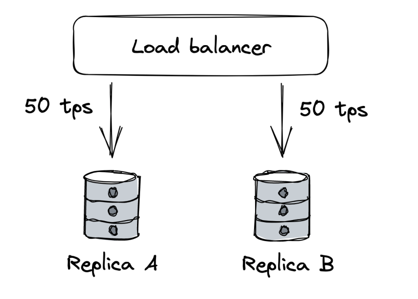

A failure like this one is very hard to handle and usually require a corrective action such as stopping all traffic temporarily.

### Managing Risk
Distributed applications need to accept that faults are inevitable and must be prepared to detect, react and repair. There are tremendous amount of faults that can occur. But we don't need to do something about all of them. We need to measure probability and impact of occurring. Afterward, prioritize the more likely and impactful faults.

Once we decide to tackle a specific fault, we can focus on reducing its impact or probability.

## Redundancy
Redundancy = Replication of functionality or state. This is the first line of defence against failures.

When functionality (or state) is replicated across multiple nodes, others can take over in the event of failure. This is the main reason distributed applications can achieve better availability than single-node apps. 

However, in order for redundancy to be effective, there are some prerequisites:
* Complexity introduces by redundancy must not cost more availability than it adds.
* The system must reliably detect which components are healthy and which aren't
* System must be able to run degraded mode.
* System must be able to recover to fully redundant mode.

Example:
* A Load Balancer can mitigate this type of fault using pool of redundant nodes.
* The Load Balancer increases the system's complexity, but the benefits in terms of scalability and availability outweigh the costs.
* Load Balancer detects faulty nodes using health checks.
* When a server is taken out of the pool, the rest of the replicas must have enough capacity to handle the load increase.
* The Load Balancer also enables the system to go back to fully redundant mode as new servers are added to the pool, requests get routed to them.

Replication for stateful services is a lot more challenging and was discussed at length at previous chapters.

### Correlation
Redundancy helps only if the nodes can't fail all at once for the same reason - ex, failures aren ot correlated.

Example:
* Memory corruption on one server is unlikely to occur on another at the same time.
* However, a data center outage (ex natural disaster) can cause all servers to go down unless they're replicated across multiple data centers.

Cloud providers (ex AWS, Azure) replicate their entire stack in multiple regions for that reason:
* Each region comprises multiple data centers, called availability zones (AZ). Those are cross-connected with high-speed network links.
* AZs are far enough from each other to minimize the risk of correlated failures.
* However, they are still close enough to have low network latency among themselves.
* The low latency enables supporting synchronous replication protocols across multiple AZs.
* Using AZs, we can create apps resilient to data center outages by load balancing instances across multiple AZs, behind a shared load balancer.

But, if we want to have even more redundancy in the vent of a catastrophic disaster, that brings down all AZs, we can duplicate the entire application stack in multiple regions:
* Load Balancing can be achieved by using global DNS load balancing.
* Using this approach, though, requires application state to be replicated asynchronously due to the high network latency between the data centers(DCs).
* Before doing this, though, you should have pretty good reason to, because it is expensive to pull of and maintain.
* A common reason for doing this is legal compliance since European customer data must be processed and stored within Europe

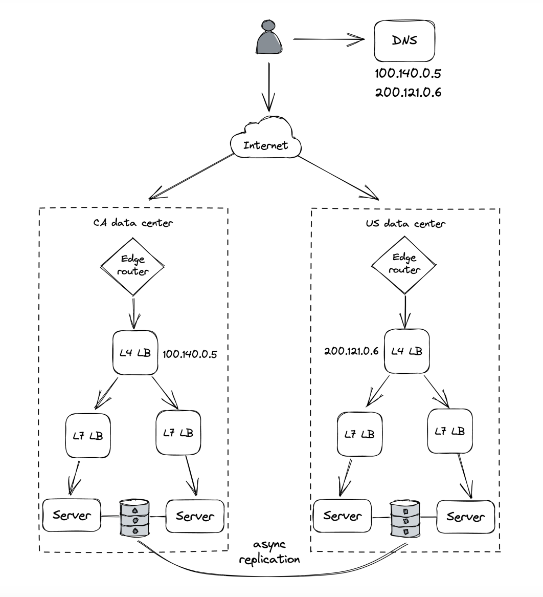

## Fault Isolation

Infrastructure faults can be controlled using redundancy. However, there are faults where redundancy won't help due to the high degree of correlation.

Example:
* Specific user sends malformed requests that causes servers handling them to crash due to a bug
* Since bug is in the code, it doesn't matter how redundant your application is
* These kinds of requests are often referred to as poison pills.
* A similar case is when a particular request requires a lot of resources to serve it and that degrades everyone else's performance ( the noisy neighbor problem).

The main issue with this example is that the blast radius of such a fault is the entire application. Hence, we can focus on reducing it by partitioning user requests, therefore reducing the blast radius to a particular partition where the user is assigned. Even if the user is degrading a partition, the rest of the partitions will be isolated from that fault. 

For example, if we partition a set of 6 instances into three partitions, a noisy neighbor can only impact 33% of users. As the number of partitions increase, the blast radius is reduced.

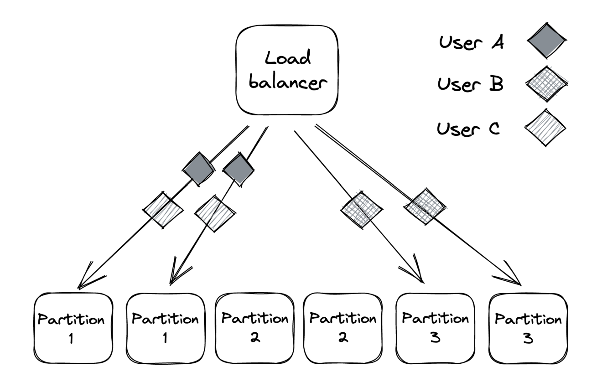

This is also referred to as the "bulkhead patterns", named after the pattern of splitting a ship's hull into compartments. If one compartment is damaged and filled with water, the rest of the compartments are left intact.

### Shuffle Sharding
The problem with partitioning is that unlucky users who end up on the degraded partition are consistently impacted as well.

A way to mitigate this is by using shuffle sharding:
* Instead of assigning an application instance to a single partition, it is assigned to multiple "virtual partitions".
* This makes it much more unlikely that two users will be assigned to the same partition - ex, 6 application instances can form up to 15 partitions
* The downside is that virtual partitions partially overlap. So faults in one partition can impact users in another one.
* However, clients can be made fault-tolerant and retry requests, so that they hit a different instances within a partition every time.
* The net effect is that impacted users the system will only experience partial degradation instead of consistent degradation.

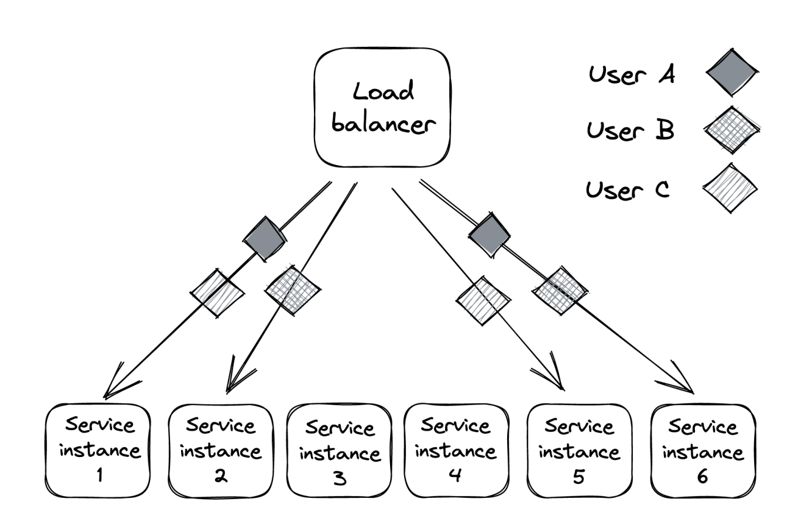

The problem with plain partitioning: Suppose you have 100 users and 10 partitions. Each user is tied to one partition only.  If Partition 3 goes bad (hardware fault, overload, bug), all the users assigned to it are consistently impacted every single time → they always hit the bad partition. This is the consistent degradation problem: unlucky users keep suffering.

#### How shuffle sharding improves this
Instead of assigning users to exactly one partition, we:
* Give each user a subset (a “shard”) of multiple partitions. 
* These shards are formed by randomly combining different application instances (virtual partitions).

Example:
* You have 6 instances (A–F). 
* Plain partitioning = you form 6 partitions (A, B, C, D, E, F). Each user only goes to one. 
* Shuffle sharding = you form combinations: (AB), (AC), (BD), (CE), (DF), etc. 
  * With 6 instances, you can form up to 15 unique shards.

Now, when a user makes a request, they get routed to one of the instances inside their shard.

#### Why this helps
* If one instance fails (say, C), only the shards that include C are degraded. 
* But users assigned to shard (AC) can still hit A on retries. 
* That means they only sometimes see failures instead of being consistently stuck on C.

So instead of 100% of requests failing for unlucky users, maybe only 20–30% fail, and retries succeed.
This turns consistent degradation → partial degradation, which is much less painful.

### Cellular architecture
We can enhance partitioning even more by partitioning the entire application stack with its dependency into cells based on the user. Each cell is completely independent of another one and a gateway service is responsible for routing requests to the right cell.

Azure Storage, for example, uses a cellular architecture. The storage clusters are the cells in the cellular architecture:

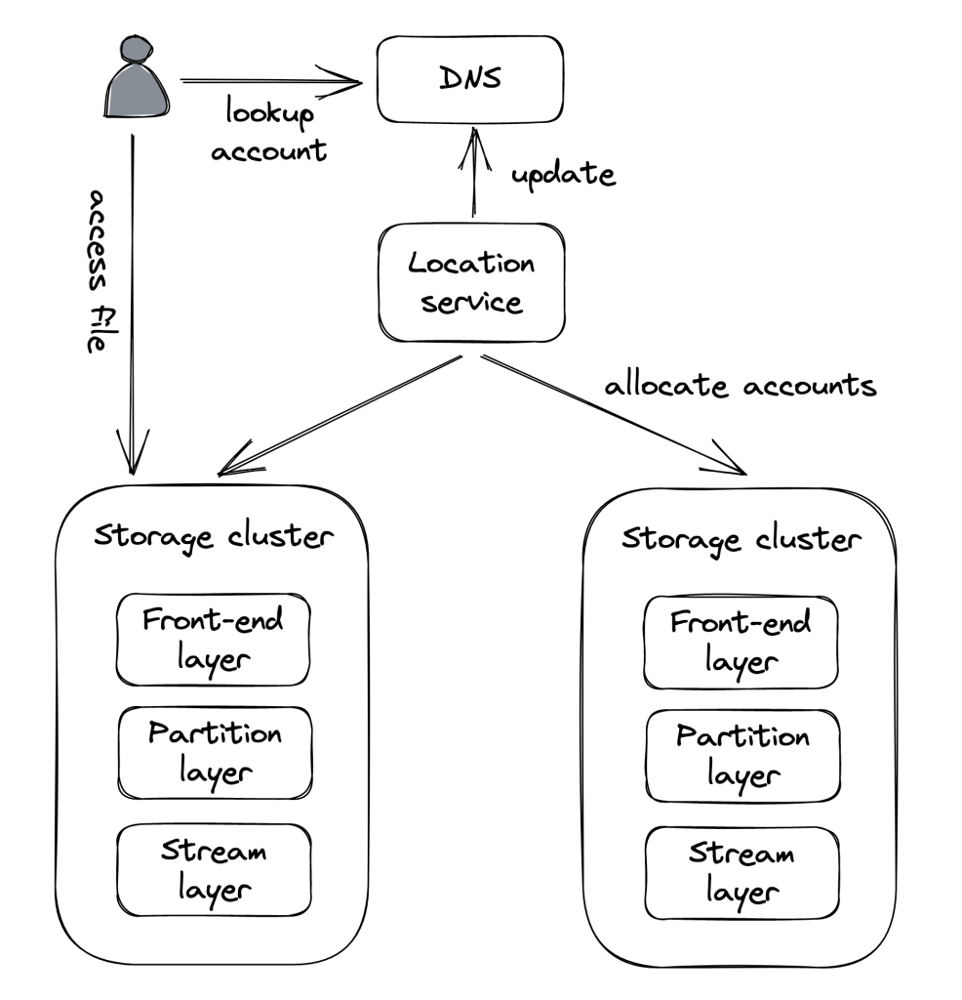

What makes a cellular architecture appealing is that a cell can have a maximum capacity. When the system needs to scale, a new cell is added vs scaling out existing ones. This enables you to throughly test and benchmark your application for the maximum cell size as you won't suddenly face a surprise surge in traffic.

#### Comparison: Shuffle Sharding vs Cellular Architecture
* Shuffle Sharding = users share overlapping sets of instances (soft isolation, partial overlap).
* Cellular Architecture = users are assigned to fully independent cells (hard isolation, no overlap).

* Shuffle sharding reduces consistent degradation → partial degradation.
* Cellular architecture eliminates overlap altogether → full fault isolation per cell.

#### Key Takeaway:
Cellular architecture is like building multiple mini-datacenters inside your system. Each cell is self-sufficient, has a tested maximum size, and scales horizontally by adding new cells instead of stretching existing ones.

## Downstream Resiliency
This section is about tactical resiliency in regard to stopping faults from propagating from one component to another.

### Timeout
When you make a network call, it's best practice to add a timeout. If timeout is not set, it is possible that a request will never return which is effectively a resource leak. Timeouts detect connectivity issues and stop them from propagating from one component to another. One practical consideration to have in mind is that most HTTP libraries don't have a timeout set by default, so you have to explicitly configure it. Rule of thumb - always set timeouts when making external calls.

#### How to Choose Timeout Duration
How to determine timeout duration? - you could base it on the desired false timeout rate - ex you want up to 0.1% of timeouts to be false. You can determine then the duration by setting it to 99.9th percentile of the downstream service's response time.
* You don’t just pick an arbitrary number (like 1s or 5s).
* Instead, you look at the downstream service’s latency distribution.
  * If you want ≤0.1% false timeouts, you set your timeout around the 99.9th percentile response time.
* Example:
  * 95% of requests finish in 50ms. 
  * 99% finish in 80ms. 
  * 99.9% finish in 200ms.
    
    → **Set timeout = ~200ms** (to cut off only extreme outliers or true failures).
  
It is also important to have good monitoring in place on integration points between systems(such as this one) - status codes, latency, success/error rates, etc. This can be managed by a reverse proxy, located on out pod, to not have to do it ourself explicitly. This is the sidecar pattern, which was already mentioned.

Instead of baking this logic into every service, you can offload it to a sidecar (reverse proxy):
* Each pod/service instance has a sidecar (e.g., Envoy, Linkerd). 
* Sidecar handles timeouts, retries, circuit-breaking, metrics, monitoring. 
* Your service just calls “localhost proxy,” and the sidecar does the heavy lifting.

This decouples business logic (your app) from resilience logic (timeouts, retries, monitoring).

### Retry
What to do when a request times out? - you can either fail fast or retry. If the timeout is due to a short-lived connectivity issue, then retry with backoff is highly probable to succeed. However if the downstream service is degraded, retrying immediately will only make matters worse. This is why retries need to be slowed down with increasing delays between them until a max number of retries is reached.

#### Exponential backoff
To configure delay between retries, we can use a capped exponential function - delay is derived by multiplying it by a constant, which exponencially increases with each retry:

`delay = min(cap, initial_backoff * 2^attempt)`

Example: cap is set to 8 -> Retries are at seconds 2, 4, 8, 8, 8, etc

If however, multiple clients get timeouts at the same time, and they apply exponential backoff concurrently, it is highly likely that they'll cause load spikes, aka retry storm:

What happens when many clients time out at once?
1. Suppose a downstream service (say Service B) slows down or briefly becomes unavailable.
2. All clients calling Service B start hitting timeouts at roughly the same time.
3. Each client retries — usually with exponential backoff (e.g., 100ms → 200ms → 400ms → 800ms …).

Why does this cause a retry storm?
* Clients are independent, so their retry timers line up in waves. 
* Instead of retrying gradually, a whole batch of clients retries at nearly the same moment. 
* This means Service B, which is already struggling, suddenly gets hit by a burst of retries (much higher load than normal). 
* If Service B wasn’t ready to recover, this burst knocks it down again, prolonging the outage.

This is the retry storm — a vicious cycle where retries amplify the load spike, preventing recovery.

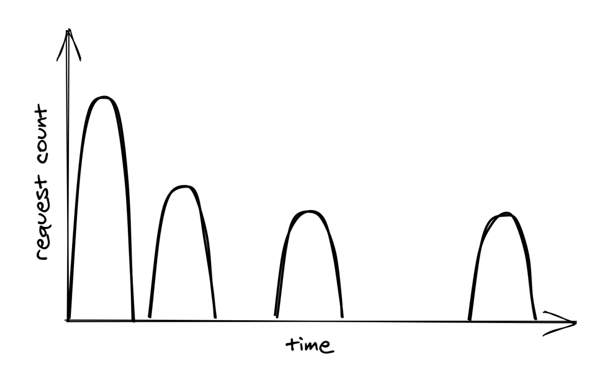

To avoid this, you can apply random jitter so that you retry doesn't collide with other clients:

`delay = random(0, min(cap, initial_backoff * 2^attempt))`

Actively waiting between retries isn't the only way to achieve retry. In batch applications, it is common for a process to be parked in a retry queue. The same process (or another) can later read from that queue and retry the requests.

Retries only make sense when a service is down due to a short-lived connectivity issue. If the error is consistent - ex service is not authorized to access endpoint, retrying won't help. Additionally, one should be wary of retrying calls to non-idempotent endpoints.

#### Retry amplification
If a request goes through a chain of services and each one of them retries, downstream retries are going to get amplified, leading to significant load on the deepest service:

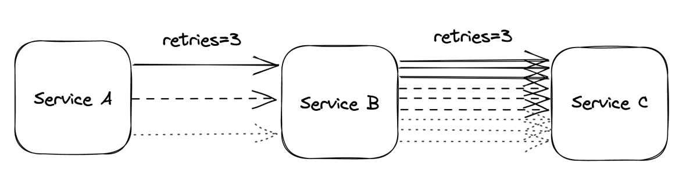

When there's a long dependency chain like this, it makes sense to retry at a single level and fail fast in all others.

### Circuit Breaker
Retries are useful when there are transient errors. If however, a service is down due to a more persistent error, retries will not help. There is an alternative approach which detect long-term degradation to a service and stops all requests until they are resolved - circuit breaker. It is useful when the downstream errors are non-transient.

Goal of circuit breaker: allow a subsystem to fail without slowing down the caller. Here's how it works:

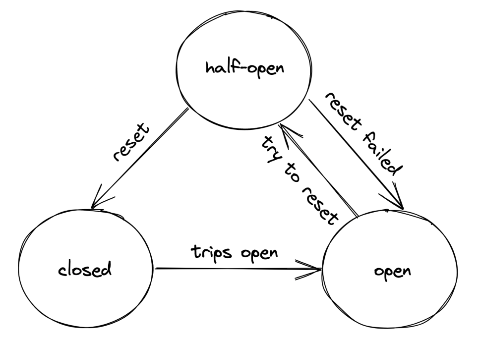

1. Closed (normal state)
   * All requests are allowed through. 
   * Failures are counted. 
   * If the failure rate crosses a threshold (e.g., 50% of requests failing in the last 10s), the breaker opens.
2. Open (tripped state)
   * Requests are blocked immediately (fail fast). 
   * Caller doesn’t waste time/resources waiting for likely failures. 
   * After a “cooldown period” (e.g., 30s), it transitions to Half-Open.
3. Half-Open (test state)
   * Only a limited number of requests are let through. 
   * If these requests succeed → breaker closes again (system is healthy). 
   * If they fail → breaker goes back to open state.

Understanding the pattern is easy, but the devils is in the details - how many failures are enough to transition to the open state? How long should it wait to attempt retransmission? Configuring this properly relies on accumulating data about past failures and the system's behaviour.

## Upstream Resiliency
This chapter focuses on patterns for protecting your own service from upstream clients.

### Load shedding
A server can't control how many requests it receives at a time. The OS has a limit on the number of ongoing connections, but the server typically reaches its limit way sooner than the OS exhaust its physical limit. This is due to running out of resources such as memory, threads, sockets, etc. It leads to requests being significantly degraded until the server eventually crashes.

To mitigate this issue, a server should reject excess requests once its capacity is reached so that it can effectively process ongoing requests. A counter can be used to measure the number of ongoing concurrent requests. It's incremented when a new request comes in and decremented once it's processed. Once the counter passes a predefined threshold(we choose it as the operators), follow-up requests are rejected with 503(Service Unavailable). This technique is referred to as **Load Shedding**.

One nuance we can implement is differentiating between low-priority and high-priority requests and only rejecting low-priority ones. Although this technique is effective, rejecting a request doesn't fully shield a server from it as it is still effectively handled. This depends on implementation - ex whether you establish a TCP connection and decode the request to make a decision. Hence, load shedding can only help so much as the load keeps increasing, the cost of rejecting requests will still lead to a degradation.

### Load Leveling
An alternative to Lead Shedding which can be leveraged when clients don't need a prompt response is Load Leveling. It involves leveraging a message queue to let the service handle requests at its own pace. This pattern is useful for leveling off short-lived load spikes until the service catches up. It doesn't work as well, though, if the load spike is consistent, leading to a backlog.

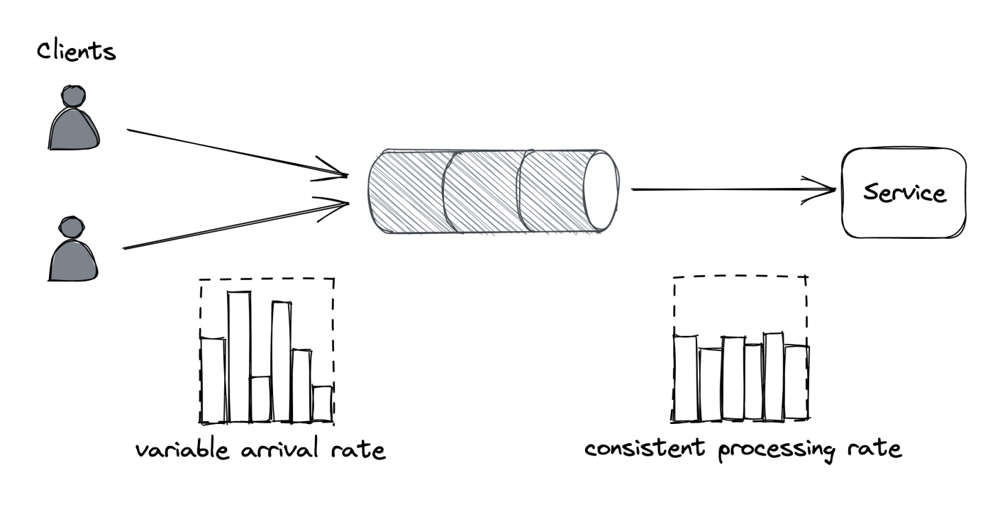

Both Load Shedding and Load Leveling don't address load increase directly. Instead, they protect a service from getting overloaded. Both mechanisms are usually combined with autoscaling so that the service can scale out to handle a consistent increase in load.

### Rate-Limiting
Rate-Limiting(aka throttling) is a mechanism for rejecting requests once a certain quota is met.

Multiple quotas can be maintained - ex both requests per second and bytes per second, and they are typically applied per user, API key or IP address. For a quota of 10 requests per second and an average load of 12 requests per second, 2 of those will be rejected per second. These kind of failures need to be designed with a special error code so that the clients are aware to retry after a while - a common HTTP Code for that is 429(To Many Requests). Additional info such as which quota was exceeded + `Retry-After` header can be included.

Use-cases:
* Preventing well-intended clients from hammering the service and letting the gracefully back-off and retry.
* Shield against client bugs which lead to excessive downstream load.
* Applying pricing tiers for platforms/infra style products.

Rate-Limiting only partially protects against DDoS attacks as nothing is stopping malicious actors from continuing to hammer the service even after a 429 status code. It isn't free either - you still have to open a TCP connection and inspect the payload to extract the API key and determine the user's available quota.

To effectively protect against DDoS, you need to leverage Economy of scale - multiple services shielded behind a gateway which protects both of them against DDoS. The cost of running the gateway is amortized across all services. 

Difference with Load Shedding - Load Shedding rejects requests based on the local state of an application instance, whereas Rate-Limiting is applied across all services instances. Due to this caveat, some form of coordination is required.

Load Shedding
* Where it happens: On a single instance of your service. 
* How it works: If the instance is overloaded (CPU too high, queue too long, memory full), it starts dropping/rejecting new requests locally to save itself. 
* Scope: Instance-level decision, based only on its own local state.

Example:
One server in your pool gets overloaded → it starts returning 503 Service Unavailable to avoid crashing. Other servers might still accept traffic fine.

Rate Limiting
* Where it happens: At the system level (across all instances). 
* How it works: There’s a global quota (e.g., 1000 requests/sec per user). Even if you run 10 instances, they must coordinate to ensure the aggregate traffic doesn’t exceed the limit. 
* Scope: Needs coordination across instances, usually via:
  * A centralized rate limiter (e.g., Redis-based counters). 
  * Or a distributed token bucket.

Example:
User A has a limit of 100 requests/sec. If User A sends 120 requests:
* With 10 servers, maybe each sees only 12 requests. 
* But rate limiting must coordinate globally → reject 20 requests across the fleet.

Key Difference
* Load Shedding → protects one instance from overload. 
* Rate Limiting → protects the whole system (and enforces fairness for clients).

#### Single-Process Implementation
How to implement rate-limiting for a single process? 
* Naive approach - store a linked list of requests per API key. Periodically, old entries are purged from the list. The problem with this approach is the large memory footprint.
* Better Alternative: 
  * Divide time into buckets woth foxed duration (ex 1m) and keep track of seen requests per bucket
    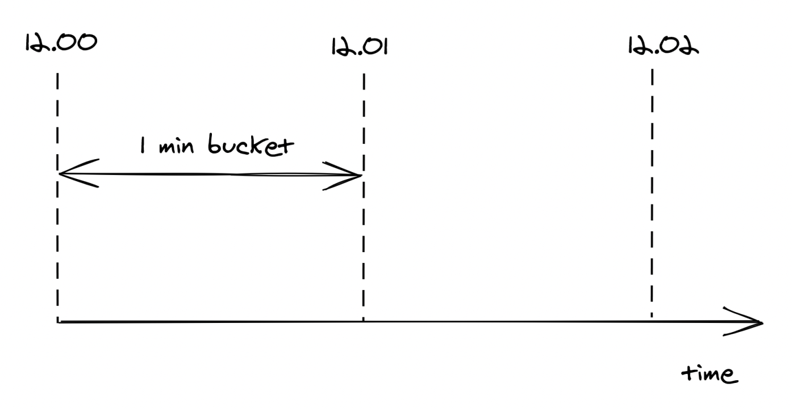
  * When a request comes, we increment the corresponding bucket's counter by one based on the request's timestamp - this technique doesn't scale memory consumption with the number of requests.
    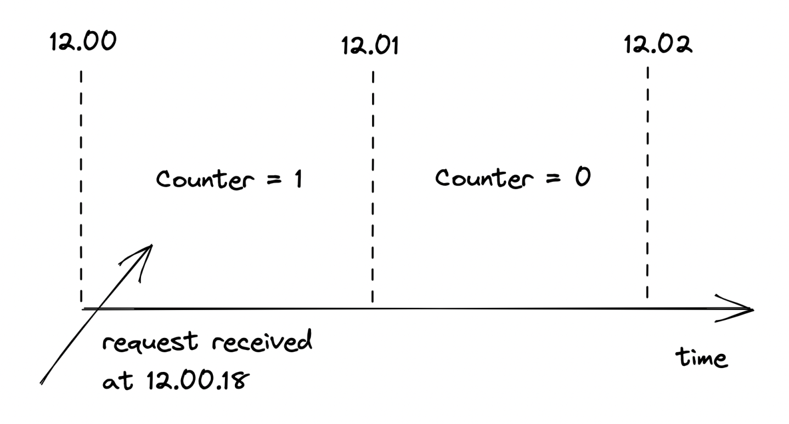
  * We only maintain at most two buckets, since we don't care about buckets older than one epoch(ie older than 1s).
  * A sliding window is used to calculate the current quota in the middle of an epoch - based on epoch overlap, % of the quota is taken(ex 60% of 3 requests is ~2).
    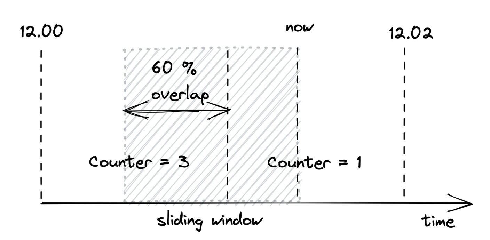
  * The sliding window technique is an approximation but it's good enough and is worth it for the smaller memory footprint. Also, the smaller the epoch, the better the approximation.

#### Distributed Implementation
When you want to scale Rate-Limiting beyond a single instance, you'll need to move the logic, described above from in-memory to an external key-value storage.

The challenge then is synchronizing concurrent reads/writes:
* One option is to leverage transactions, but that is not effective enough for such a critical path component. A subtler issue is that the service has a hard dependency on the external data store.
* A better alternative is using the atomic `compare-and-swap(CAS)` style APIs distributed data stores provide. A particularly useful one is `getAndIncrement`.
* To remove the hard dependency, we can batch updates in-memory, and we periodically flush them to the distributed store. This makes the calculations slightly inaccurate but accurate enough.
* In the event the data store is down, we temporarily fall back to using in-memory store exclusively.

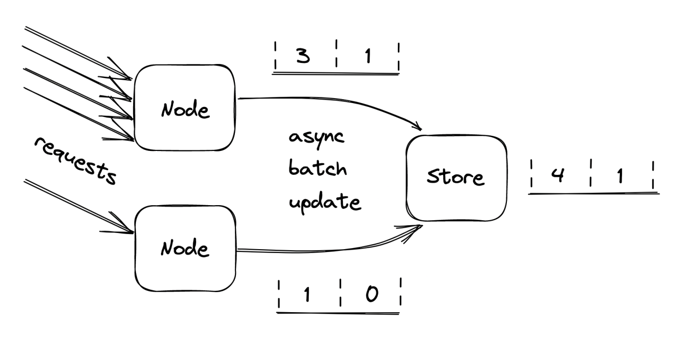

| Approach | How it works | Pros | Cons |
|----------|-------------|------|------|
| **Transactions** | Read → modify → write with transaction | Simple conceptually | Too slow for high-traffic critical paths; still introduces hard dependency |
| **CAS (Compare-and-Swap) / getAndIncrement** | Atomically increment the counter in the distributed store | Fast, atomic, safe across instances | Still requires store availability; might add latency |
| **In-memory batching + periodic flush** | Count requests locally in memory; periodically write totals to store | Reduces store dependency; fast | Slightly inaccurate counters; some quota enforcement “drift” |
| **Fallback to in-memory** | If store is down, rely on local memory counters | Keeps service running | Temporary quota inaccuracies; possible unfairness |

### Constant work
In the event an application gets overloaded, some of its mechanisms start behaving differently - ex how a query is executed in an overloaded database is different from how it's executed in happy times. This type of behaviour is referred to as multi-modal. Some of the modes can trigger rare bugs due to code assuming the happy path at all times. They also make life harder for operators because the mental model of the application's behaviour expands.

Hence, as a general rule of thumb - strive to reduce the number of modes in an application. For example, prefer a key-value store vs a traditional relational database in a data plane due to their predictable performance. A relational database has a lot of hidden optimizations based on the load, which leads to a multi-modal system. 

In an ideal world, the worst and average-case behaviour shouldn't differ. You can use the **constant work pattern** to achieve this. The idea is to have the system perform the same amount of work under high load as under normal load. If there is any variation during stress periods, it better be because the system is performing better. Such system is **antifragile**. A resilient system keeps operating under increased load. An antifragile system performs better.

An example of the constant work pattern is propagating changes from the control plane to the data plane:
* The control plane stores a bag of settings for each user, like the quotas used by the rate limiter.
* When settings changes, the control plane needs to broadcast the change to the data plane. This mechanism makes the work proportional to the number of changes.
* This can lead to an issue if multiple configuration changes are made for all users concurrently, leading to a burst of update messages, which the data plane can't handle.
* Alternatively, the control plane can periodically dump the configuration in a highly-available file store (ex Amazon S3), which includes the configuration for all users, not just updated ones.
* Data planes then periodically lead the dump in bulk and refresh their local state.
* No matter how many updates happen, the work done by the control and data planes is constant.

A niche extension is preallocating the configuration with keys for every user in the system. If the data plane can process that configuration, this guarantees that the processing time will stay the same regardless of what happens. This is typically used in cellular architectures where the maximum number of users in a system is limited.

Advantages:
* Not only is it reliable, it's also easier to implement than an event-sourcing approach where you have to process individual stacked updates.
* This is robust against all sorts of failures due to it's self-healing properties. If the config file gets corrupted, the next update will automatically resolve the issue.

The main advantage is that constant work is more expensive than doing just necessary work. But it leads to increased reliability, and it reduces the implementation complexity.

## Summary
As the number of components in a system increases, so does the possible failures. Anything that can happen will happen. 

Usually, a production engineer is more worried about minimizing and tolerating failure vs scaling the system. This is because scaling is only necessary until you hit the next scalability bottleneck. Handling failures is a consistent worry, regardless of your scale. 

Failures ane inevitable. When you can't design them away, focus on reducing their blast radius.